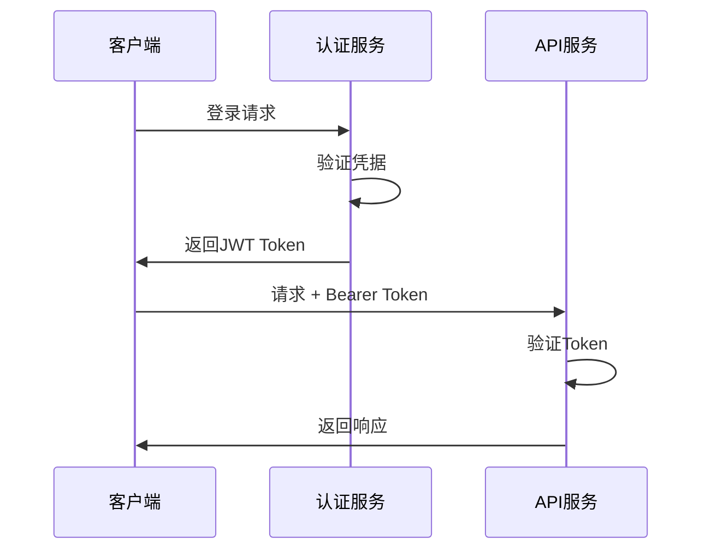

# MomoCodeAgent API设计文档

## 1. API概览

### 1.1 基础信息
- **Base URL**: `https://api.momocodeagent.com/v1`
- **认证方式**: JWT Bearer Token
- **数据格式**: JSON
- **字符编码**: UTF-8

### 1.2 API版本控制
- **版本策略**: URL路径版本控制
- **当前版本**: v1
- **向后兼容**: 保持向后兼容性
- **废弃策略**: 提前6个月通知废弃

## 2. 认证和授权

### 2.1 认证流程



### 2.2 Token管理
- **访问令牌**: 有效期2小时
- **刷新令牌**: 有效期30天
- **令牌刷新**: 自动刷新机制
- **令牌撤销**: 支持主动撤销

## 3. 核心API接口

### 3.1 搜索接口

#### 3.1.1 基础搜索
```http
POST /search
Content-Type: application/json
Authorization: Bearer <token>

{
  "query": "查找用户认证相关的函数",
  "filters": {
    "language": ["python", "javascript"],
    "file_type": ["function", "class"],
    "path_pattern": "**/auth/**"
  },
  "options": {
    "max_results": 20,
    "include_context": true,
    "highlight": true
  }
}
```

**响应示例**:
```json
{
  "request_id": "req_123456",
  "query": "查找用户认证相关的函数",
  "results": [
    {
      "id": "entity_001",
      "type": "function",
      "name": "authenticate_user",
      "file_path": "src/auth/user_auth.py",
      "start_line": 45,
      "end_line": 67,
      "content": "def authenticate_user(username, password):\n    # 用户认证逻辑\n    ...",
      "score": 0.95,
      "match_type": "semantic",
      "highlights": ["authenticate_user", "用户认证"],
      "context": {
        "imports": ["from flask import request"],
        "dependencies": ["validate_password", "get_user_by_name"]
      }
    }
  ],
  "total_results": 15,
  "search_time_ms": 245,
  "suggestions": [
    "查找密码验证函数",
    "查找用户管理相关代码"
  ]
}
```

#### 3.1.2 探索性搜索
```http
POST /search/explore
Content-Type: application/json
Authorization: Bearer <token>

{
  "query": "了解用户管理模块的结构",
  "exploration_depth": 3,
  "include_dependencies": true,
  "include_relationships": true
}
```

#### 3.1.3 诊断搜索
```http
POST /search/diagnose
Content-Type: application/json
Authorization: Bearer <token>

{
  "query": "解决用户登录失败的问题",
  "error_context": {
    "error_message": "Authentication failed",
    "stack_trace": "...",
    "file_path": "src/auth/login.py",
    "line_number": 23
  }
}
```

### 3.2 代码分析接口

#### 3.2.1 代码质量分析
```http
POST /analyze/quality
Content-Type: application/json
Authorization: Bearer <token>

{
  "file_path": "src/auth/user_auth.py",
  "analysis_type": "comprehensive",
  "include_suggestions": true
}
```

**响应示例**:
```json
{
  "file_path": "src/auth/user_auth.py",
  "quality_score": 8.5,
  "metrics": {
    "complexity": 6.2,
    "maintainability": 8.8,
    "testability": 7.5,
    "security": 9.0
  },
  "issues": [
    {
      "type": "code_smell",
      "severity": "medium",
      "message": "函数过长，建议拆分",
      "line": 45,
      "suggestion": "将认证逻辑拆分为多个小函数"
    }
  ],
  "suggestions": [
    {
      "type": "refactoring",
      "description": "提取密码验证逻辑",
      "impact": "high",
      "effort": "medium"
    }
  ]
}
```

#### 3.2.2 依赖关系分析
```http
GET /analyze/dependencies/{file_path}
Authorization: Bearer <token>
```

#### 3.2.3 相似代码检测
```http
POST /analyze/similar
Content-Type: application/json
Authorization: Bearer <token>

{
  "file_path": "src/auth/user_auth.py",
  "similarity_threshold": 0.8,
  "include_patterns": true
}
```

### 3.3 代码库管理接口

#### 3.3.1 代码库注册
```http
POST /repositories
Content-Type: application/json
Authorization: Bearer <token>

{
  "name": "my-project",
  "path": "/path/to/repository",
  "language": ["python", "javascript"],
  "git_url": "https://github.com/user/repo.git",
  "indexing_options": {
    "include_patterns": ["**/*.py", "**/*.js"],
    "exclude_patterns": ["**/test/**", "**/node_modules/**"],
    "max_file_size": 1048576
  }
}
```

#### 3.3.2 代码库状态查询
```http
GET /repositories/{repo_id}/status
Authorization: Bearer <token>
```

#### 3.3.3 代码库更新
```http
PUT /repositories/{repo_id}
Content-Type: application/json
Authorization: Bearer <token>

{
  "name": "updated-project-name",
  "indexing_options": {
    "include_patterns": ["**/*.py", "**/*.js", "**/*.ts"]
  }
}
```

### 3.4 用户管理接口

#### 3.4.1 用户注册
```http
POST /users/register
Content-Type: application/json

{
  "username": "john_doe",
  "email": "john@example.com",
  "password": "secure_password",
  "full_name": "John Doe"
}
```

#### 3.4.2 用户登录
```http
POST /users/login
Content-Type: application/json

{
  "username": "john_doe",
  "password": "secure_password"
}
```

#### 3.4.3 用户信息查询
```http
GET /users/profile
Authorization: Bearer <token>
```

### 3.5 反馈接口

#### 3.5.1 搜索结果反馈
```http
POST /feedback/search
Content-Type: application/json
Authorization: Bearer <token>

{
  "request_id": "req_123456",
  "result_id": "entity_001",
  "rating": 5,
  "feedback_type": "helpful",
  "comment": "这个结果很准确，帮助我快速找到了需要的代码"
}
```

#### 3.5.2 建议反馈
```http
POST /feedback/suggestions
Content-Type: application/json
Authorization: Bearer <token>

{
  "suggestion_type": "feature_request",
  "title": "支持更多编程语言",
  "description": "希望能够支持Go和Rust语言的代码检索",
  "priority": "medium"
}
```

## 4. WebSocket接口

### 4.1 实时搜索
```javascript
// 连接WebSocket
const ws = new WebSocket('wss://api.momocodeagent.com/v1/search/stream');

// 发送搜索请求
ws.send(JSON.stringify({
  "query": "查找数据库连接相关代码",
  "stream_results": true
}));

// 接收实时结果
ws.onmessage = function(event) {
  const data = JSON.parse(event.data);
  console.log('搜索结果:', data);
};
```

### 4.2 代码变更通知
```javascript
// 订阅代码变更
ws.send(JSON.stringify({
  "action": "subscribe",
  "channel": "code_changes",
  "repository_id": "repo_123"
}));

// 接收变更通知
ws.onmessage = function(event) {
  const notification = JSON.parse(event.data);
  console.log('代码变更:', notification);
};
```

## 5. 错误处理

### 5.1 错误响应格式
```json
{
  "error": {
    "code": "INVALID_QUERY",
    "message": "查询参数无效",
    "details": {
      "field": "query",
      "reason": "查询不能为空"
    },
    "request_id": "req_123456",
    "timestamp": "2024-01-15T10:30:00Z"
  }
}
```

### 5.2 错误代码定义

| 错误代码 | HTTP状态码 | 描述 |
|----------|------------|------|
| `INVALID_TOKEN` | 401 | 无效的认证令牌 |
| `INVALID_QUERY` | 400 | 查询参数无效 |
| `REPOSITORY_NOT_FOUND` | 404 | 代码库不存在 |
| `INDEXING_IN_PROGRESS` | 409 | 索引正在构建中 |
| `RATE_LIMIT_EXCEEDED` | 429 | 请求频率超限 |
| `INTERNAL_ERROR` | 500 | 服务器内部错误 |

## 6. 限流和配额

### 6.1 限流策略
- **免费用户**: 100次/小时
- **付费用户**: 1000次/小时
- **企业用户**: 无限制

### 6.2 配额管理
```http
GET /quota/usage
Authorization: Bearer <token>
```

**响应示例**:
```json
{
  "quota_type": "search_requests",
  "limit": 1000,
  "used": 245,
  "remaining": 755,
  "reset_time": "2024-01-15T11:00:00Z"
}
```

## 7. SDK和示例

### 7.1 Python SDK示例
```python
from momocodeagent import Client

# 初始化客户端
client = Client(api_key="your_api_key")

# 基础搜索
results = client.search(
    query="查找用户认证函数",
    filters={"language": ["python"]},
    max_results=10
)

# 探索性搜索
exploration = client.explore(
    query="了解用户管理模块",
    depth=3
)

# 代码质量分析
quality = client.analyze_quality(
    file_path="src/auth/user_auth.py"
)
```

### 7.2 JavaScript SDK示例
```javascript
import { MomoCodeAgent } from 'momocodeagent-js';

// 初始化客户端
const client = new MomoCodeAgent({
  apiKey: 'your_api_key'
});

// 基础搜索
const results = await client.search({
  query: '查找用户认证函数',
  filters: { language: ['javascript'] },
  maxResults: 10
});

// 探索性搜索
const exploration = await client.explore({
  query: '了解用户管理模块',
  depth: 3
});
```

## 8. 测试和调试

### 8.1 API测试工具
- **Postman集合**: 提供完整的API测试集合
- **Swagger UI**: 在线API文档和测试
- **curl示例**: 命令行测试示例

### 8.2 调试信息
```http
GET /debug/info
Authorization: Bearer <token>
```

**响应示例**:
```json
{
  "version": "1.0.0",
  "environment": "production",
  "timestamp": "2024-01-15T10:30:00Z",
  "request_id": "req_123456",
  "processing_time_ms": 245,
  "cache_hit": true,
  "index_status": "up_to_date"
}
```

这个API设计文档提供了完整的接口规范，包括认证、核心功能、错误处理、限流等各个方面，可以作为开发团队和第三方集成的参考。
