# MomoCodeAgent 技术架构设计文档

## 1. 项目概述

### 1.1 项目目标
构建一个基于Agent架构的智能代码库检索工具，具备以下核心能力：
- 深度理解用户查询意图
- 高效的代码检索性能
- 智能的深度检索和关联分析
- 可扩展的多语言支持

### 1.2 核心特性
- **语义理解**：将自然语言查询转换为结构化搜索条件
- **多层级检索**：结合语义、关键词、结构三种检索方式
- **智能关联**：基于代码依赖关系进行深度检索
- **实时响应**：毫秒级检索响应时间
- **可扩展性**：支持大规模代码库（百万行级别）

## 2. 系统架构

### 2.1 整体架构图

```
┌─────────────────────────────────────────────────────────────┐
│                       前端展示层                              │
├─────────────────────────────────────────────────────────────┤
│  Web UI  │  CLI  │  API Gateway  │  IDE Plugin  │  Mobile  │
└─────────────────────────────────────────────────────────────┘
                                │
┌─────────────────────────────────────────────────────────────┐
│                      API服务层                               │
├─────────────────────────────────────────────────────────────┤
│  Query Router  │  Auth Service  │  Rate Limiter  │  Cache   │
└─────────────────────────────────────────────────────────────┘
                                │
┌─────────────────────────────────────────────────────────────┐
│                     Agent核心层                              │
├─────────────────────────────────────────────────────────────┤
│ Intent Agent │ Search Agent │ Analysis Agent │ Response Agent│
└─────────────────────────────────────────────────────────────┘
                                │
┌─────────────────────────────────────────────────────────────┐
│                    检索引擎层                                │
├─────────────────────────────────────────────────────────────┤
│ Vector DB │ Text Search │ AST Parser │ Graph DB │ Cache Layer│
└─────────────────────────────────────────────────────────────┘
                                │
┌─────────────────────────────────────────────────────────────┐
│                    数据存储层                                │
├─────────────────────────────────────────────────────────────┤
│  Code Index  │  Metadata  │  User Data  │  Analytics  │ Logs │
└─────────────────────────────────────────────────────────────┘
```

### 2.2 核心组件设计

#### 2.2.1 Agent核心层

**Intent Agent（意图理解代理）**
- 功能：解析用户查询，识别查询类型和意图
- 技术：基于LLM的意图分类和实体提取
- 输入：自然语言查询
- 输出：结构化查询对象

**Search Agent（检索代理）**
- 功能：执行多层级检索策略
- 技术：协调向量检索、文本检索、结构检索
- 输入：结构化查询对象
- 输出：候选结果集

**Analysis Agent（分析代理）**
- 功能：深度分析代码关联性和质量
- 技术：图算法、代码质量分析
- 输入：候选结果集
- 输出：排序后的结果集

**Response Agent（响应代理）**
- 功能：生成用户友好的响应
- 技术：模板引擎、结果聚合
- 输入：分析后的结果集
- 输出：最终响应

## 3. 技术选型

### 3.1 后端技术栈

| 组件 | 技术选型 | 理由 |
|------|----------|------|
| 编程语言 | Python 3.11+ | 丰富的AI/ML生态，快速开发 |
| Web框架 | FastAPI | 高性能，自动API文档，类型安全 |
| 异步框架 | asyncio + aiohttp | 高并发处理能力 |
| 向量数据库 | Chroma | 轻量级，易于部署，Python原生支持 |
| 搜索引擎 | Elasticsearch | 强大的全文搜索能力，支持复杂查询 |
| 图数据库 | Neo4j | 优秀的图关系查询性能 |
| 缓存 | Redis | 高性能内存缓存 |
| 消息队列 | RabbitMQ | 可靠的消息传递 |
| 容器化 | Docker + Kubernetes | 微服务部署和扩展 |

### 3.2 前端技术栈

| 组件 | 技术选型 | 理由 |
|------|----------|------|
| 框架 | React 18 + TypeScript | 组件化开发，类型安全 |
| 状态管理 | Zustand | 轻量级状态管理 |
| UI组件库 | Ant Design | 丰富的组件，企业级设计 |
| 构建工具 | Vite | 快速的开发构建 |
| 图表库 | ECharts | 强大的数据可视化能力 |

### 3.3 AI/ML技术栈

| 组件 | 技术选型 | 理由 |
|------|----------|------|
| 嵌入模型 | sentence-transformers/all-MiniLM-L6-v2 | 轻量级，多语言支持 |
| 代码理解 | CodeBERT | 专门针对代码的预训练模型 |
| LLM集成 | OpenAI GPT-4 / Ollama | 强大的语言理解能力 |
| 向量化 | FAISS | 高效的向量相似性搜索 |

## 4. 数据模型设计

### 4.1 代码实体模型

```python
class CodeEntity:
    id: str
    type: str  # file, function, class, variable
    name: str
    content: str
    language: str
    file_path: str
    start_line: int
    end_line: int
    ast_path: str  # AST中的路径
    metadata: Dict[str, Any]
    embeddings: List[float]
    created_at: datetime
    updated_at: datetime
```

### 4.2 查询模型

```python
class Query:
    id: str
    text: str
    intent: str  # search, analyze, refactor, debug
    entities: List[str]  # 提取的实体
    filters: Dict[str, Any]  # 过滤条件
    context: Dict[str, Any]  # 上下文信息
    created_at: datetime
```

### 4.3 检索结果模型

```python
class SearchResult:
    entity: CodeEntity
    score: float
    match_type: str  # semantic, keyword, structural
    highlights: List[str]  # 高亮片段
    related_entities: List[str]  # 相关实体ID
    explanation: str  # 匹配原因说明
```

### 4.4 动态更新相关模型

```python
class FileChangeEvent:
    id: str
    file_path: str
    change_type: str  # created, modified, deleted, moved
    old_path: Optional[str]  # 用于移动操作
    timestamp: datetime
    file_size: int
    file_hash: str
    git_commit: Optional[str]
    metadata: Dict[str, Any]

class GitChange:
    file_path: str
    change_type: str
    old_sha: Optional[str]
    new_sha: Optional[str]
    diff_content: str
    commit_message: str
    author: str
    timestamp: datetime

class UpdateTask:
    id: str
    file_path: str
    task_type: str  # index, update, delete, move
    priority: int  # 1-10, 10最高
    status: str  # pending, processing, completed, failed
    retry_count: int
    created_at: datetime
    started_at: Optional[datetime]
    completed_at: Optional[datetime]
    error_message: Optional[str]

class IndexStatus:
    file_path: str
    last_updated: datetime
    version: int
    status: str  # indexed, outdated, error
    checksum: str
    dependencies: List[str]
```

## 5. Agentic搜索流程设计

### 5.1 整体搜索流程架构

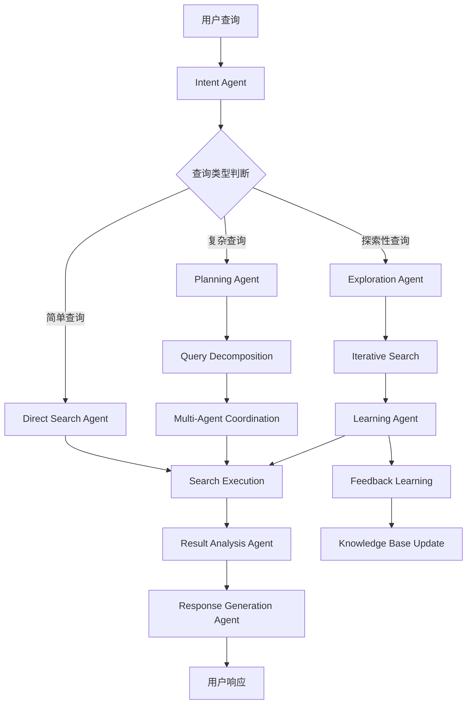

### 5.2 核心Agent职责分工

| Agent | 主要职责 | 输入 | 输出 |
|-------|----------|------|------|
| **Intent Agent** | 意图理解和查询分析 | 用户查询文本 | 结构化查询对象 |
| **Planning Agent** | 复杂查询规划和分解 | 意图分析结果 | 搜索执行计划 |
| **Search Execution Agent** | 多层级搜索执行 | 查询对象+策略 | 搜索结果集 |
| **Result Analysis Agent** | 结果分析和排序 | 原始搜索结果 | 优化后的结果 |
| **Response Generation Agent** | 响应生成和格式化 | 分析后的结果 | 用户友好的响应 |
| **Learning Agent** | 持续学习和优化 | 用户反馈 | 模型更新 |

### 5.3 搜索策略决策流程

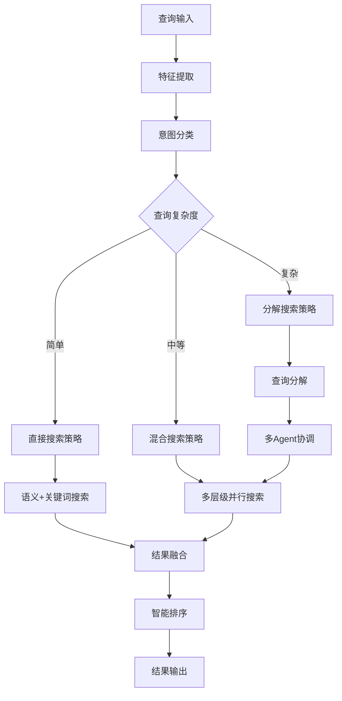

### 5.4 多Agent协调机制

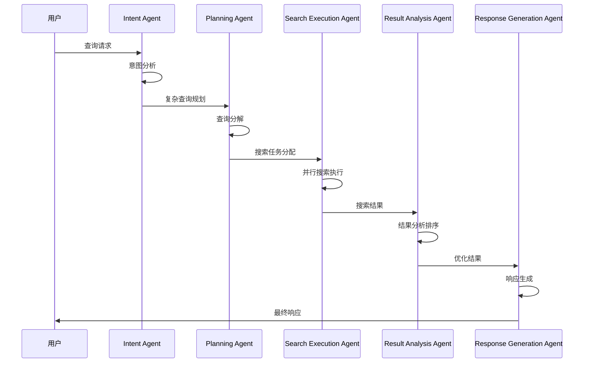

### 5.5 学习反馈循环

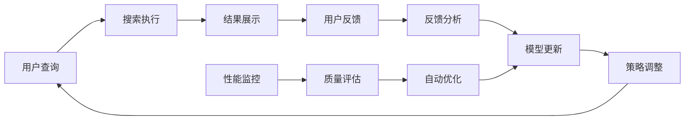

### 5.6 智能搜索策略

**策略选择机制**
- **特征分析**：基于查询长度、关键词密度、语法复杂度等特征
- **历史性能**：参考相似查询的历史搜索效果
- **机器学习推荐**：使用训练好的模型预测最优策略
- **动态调整**：根据实时反馈调整策略参数

**探索性搜索流程**
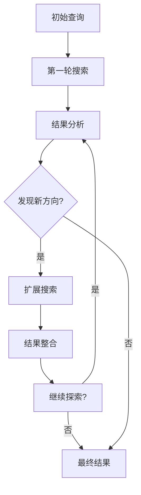

### 5.7 多Agent协调机制

**协调策略**
- **任务分解**：将复杂查询分解为多个子任务
- **依赖管理**：处理任务间的依赖关系
- **资源分配**：合理分配计算资源给不同Agent
- **结果聚合**：整合多个Agent的搜索结果

**通信协议**
- **消息总线**：基于Redis的发布/订阅模式
- **协议标准化**：统一的Agent间通信协议
- **协商机制**：Agent间的冲突解决和共识达成
- **状态同步**：实时同步Agent状态和进度

### 5.8 学习适应机制

**学习类型**
- **监督学习**：基于用户反馈的模型训练
- **强化学习**：通过交互优化搜索策略
- **在线学习**：实时更新模型参数
- **迁移学习**：利用历史数据提升新场景性能

**反馈收集**
- **显式反馈**：用户评分、点击、收藏等行为
- **隐式反馈**：停留时间、滚动深度、搜索修改等
- **上下文反馈**：基于用户画像和历史行为的反馈
- **质量反馈**：搜索结果的相关性和准确性评估

## 6. 核心算法设计

### 6.1 多层级检索算法

```python
class MultiLevelSearch:
    def search(self, query: Query) -> List[SearchResult]:
        # 1. 语义检索
        semantic_results = self.semantic_search(query)
        
        # 2. 关键词检索
        keyword_results = self.keyword_search(query)
        
        # 3. 结构检索
        structural_results = self.structural_search(query)
        
        # 4. 结果融合和排序
        return self.merge_and_rank(semantic_results, keyword_results, structural_results)
```

### 5.9 具体搜索场景

**场景分类**
- **精确查找**：用户明确知道要找的函数、类、变量等
- **探索性搜索**：用户想了解代码库结构和相关代码
- **问题诊断**：用户遇到错误需要调试和解决
- **重构建议**：用户想要优化和改进代码

**场景处理流程**
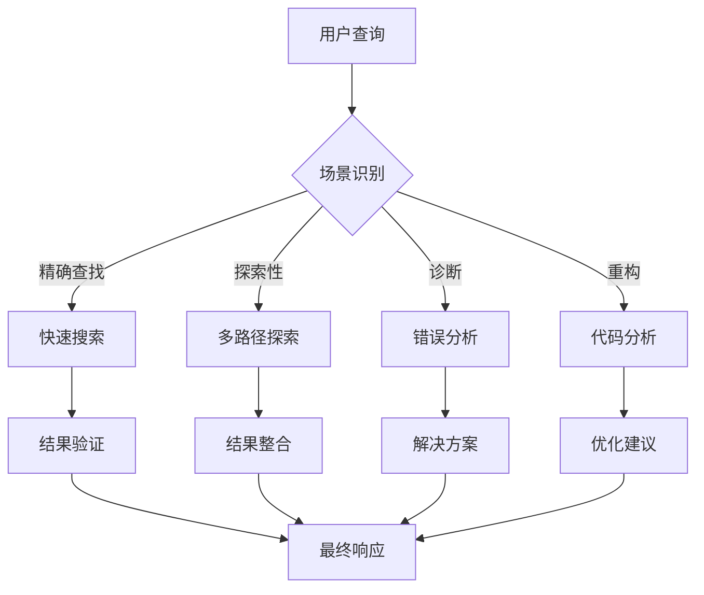

### 5.10 智能决策引擎

**决策机制**
- **特征提取**：从查询和上下文中提取关键特征
- **决策树推理**：基于规则和机器学习模型进行决策
- **置信度评估**：评估决策的可信度
- **动态调整**：根据反馈调整决策策略

**上下文感知**
- **会话管理**：维护用户会话状态
- **用户画像**：基于历史行为构建用户画像
- **实时状态**：监控代码库和系统状态
- **历史分析**：分析用户查询历史模式

### 5.11 自适应学习机制

**学习策略**
- **在线学习**：实时从用户交互中学习
- **批量学习**：定期批量更新模型
- **强化学习**：通过奖励机制优化策略
- **迁移学习**：利用预训练模型加速学习

**反馈机制**
- **显式反馈**：用户直接评分和评价
- **隐式反馈**：用户行为模式分析
- **质量反馈**：搜索结果质量评估
- **性能反馈**：系统性能指标监控

## 6. 核心算法设计

### 6.1 多层级检索算法流程

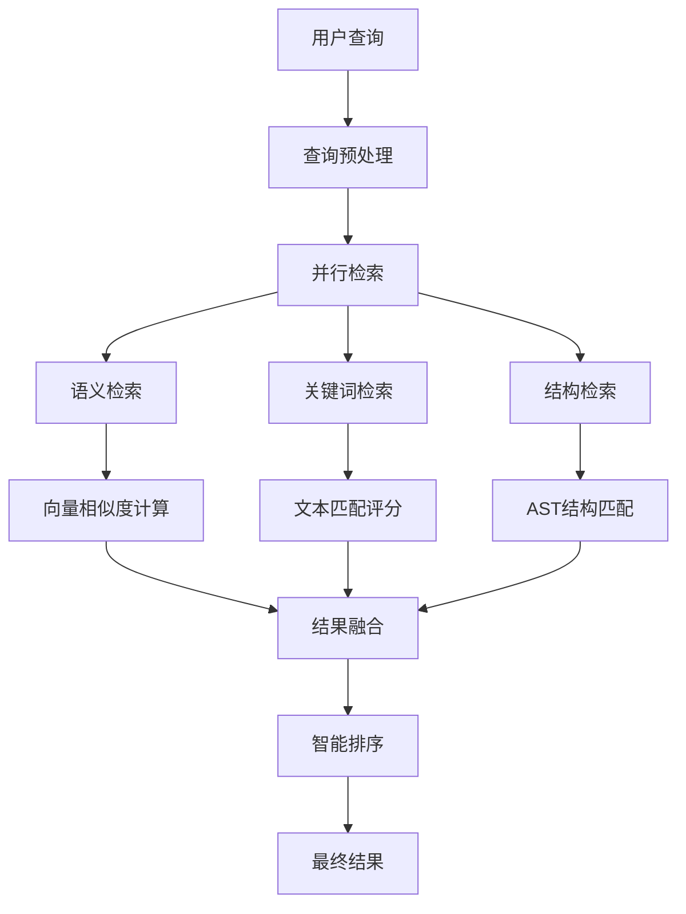

### 6.2 意图理解算法流程

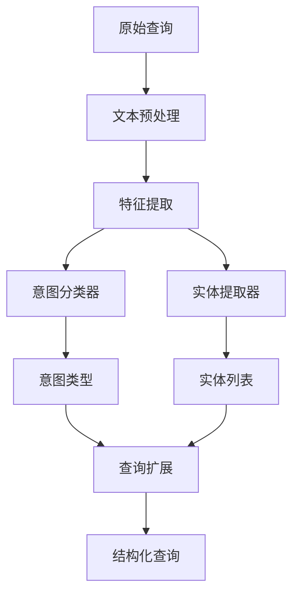

### 6.3 深度检索算法流程

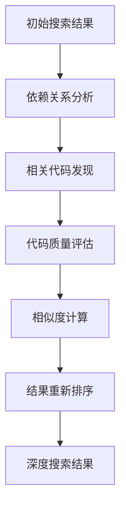

## 6. 动态更新机制

### 6.1 代码变更检测流程

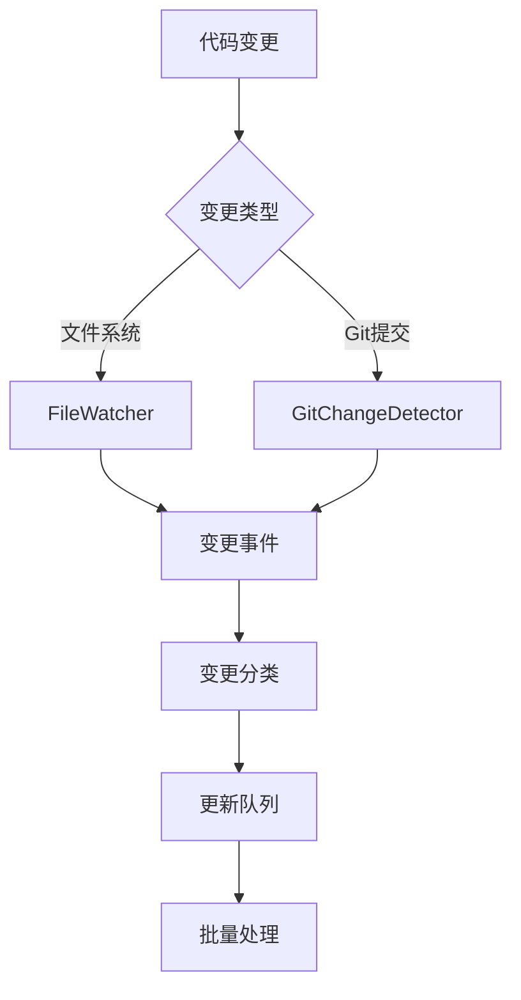

### 6.2 增量索引更新流程

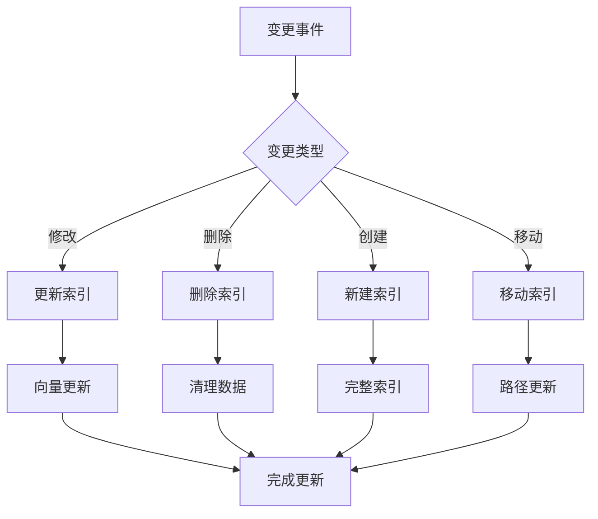

### 6.3 实时同步机制

**同步策略**
- **WebSocket推送**：实时向客户端推送更新状态
- **Redis发布/订阅**：基于消息总线的通知机制
- **多频道支持**：支持不同类型的变更通知
- **客户端管理**：维护连接状态和订阅关系

### 6.4 冲突解决和一致性保证

**一致性策略**
- **乐观锁机制**：基于版本号的并发控制
- **最终一致性**：定期检查和修复数据不一致
- **冲突检测**：自动识别和解决更新冲突
- **数据修复**：自动修复损坏或不一致的数据

### 6.5 性能优化策略

**优化机制**
- **批量处理**：将多个更新操作合并处理
- **依赖优化**：基于依赖关系优化更新顺序
- **缓存策略**：避免重复处理未变更的文件
- **并行处理**：多线程并行处理不同类型的更新

## 7. 性能优化策略

### 7.1 索引优化
- **分层索引**：按代码类型和语言分别建立索引
- **增量更新**：支持代码变更的增量索引更新
- **压缩存储**：使用高效的压缩算法减少存储空间

### 7.2 查询优化
- **查询缓存**：缓存常见查询结果
- **并行处理**：多线程并行执行不同类型的检索
- **结果预取**：预测用户可能的后续查询

### 7.3 系统优化
- **负载均衡**：多实例部署，智能负载分配
- **CDN加速**：静态资源CDN分发
- **数据库优化**：读写分离，索引优化

## 8. 部署架构

### 8.1 微服务架构

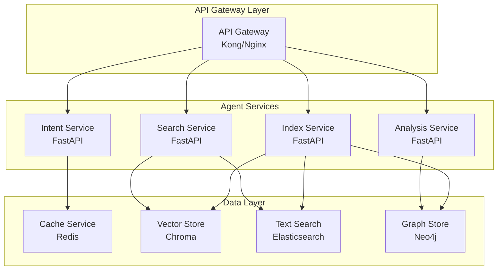

### 8.2 容器化部署

**服务组件**
- **API Gateway**：统一入口，负载均衡，认证授权
- **Agent Services**：Intent、Search、Analysis、Index服务
- **Data Services**：Redis、Chroma、Elasticsearch、Neo4j
- **Update Services**：File Watcher、Update Processor、Consistency Checker

**部署策略**
- **水平扩展**：支持多实例部署
- **健康检查**：自动检测服务状态
- **滚动更新**：零停机部署
- **资源限制**：CPU和内存限制

### 8.3 动态更新服务

**服务配置**
- **File Watcher**：监控文件变更，支持批量处理
- **Update Processor**：处理索引更新，支持并行处理
- **Consistency Checker**：定期检查数据一致性

**配置参数**
- **监控路径**：可配置的监控目录
- **排除模式**：忽略特定文件和目录
- **批处理大小**：优化处理性能
- **检查间隔**：一致性检查频率

## 9. 监控和运维

### 9.1 监控指标

**性能指标**
- **响应时间**：API响应时间、搜索延迟
- **吞吐量**：每秒查询数、并发用户数
- **错误率**：API错误率、搜索失败率

**业务指标**
- **查询成功率**：搜索成功率统计
- **用户满意度**：用户反馈评分
- **搜索质量**：结果相关性评分

**系统指标**
- **资源使用**：CPU、内存、磁盘使用率
- **数据库性能**：查询延迟、连接数
- **缓存效率**：命中率、过期率

**动态更新指标**
- **变更检测延迟**：文件变更到检测的时间
- **索引更新时间**：索引更新的处理时间
- **更新队列长度**：待处理更新任务数量
- **一致性检查结果**：数据一致性状态
- **更新失败率**：更新操作失败比例

### 9.2 日志管理

**日志策略**
- **结构化日志**：JSON格式，便于分析
- **分级记录**：DEBUG、INFO、WARN、ERROR
- **日志轮转**：自动清理历史日志
- **敏感信息过滤**：避免记录敏感数据

**日志聚合**
- **ELK Stack**：Elasticsearch + Logstash + Kibana
- **实时监控**：实时日志分析和告警
- **历史分析**：长期趋势分析
- **可视化**：日志数据可视化展示

### 9.3 告警机制

**告警规则**
- **性能告警**：响应时间超过阈值
- **错误告警**：错误率超过阈值
- **资源告警**：CPU/内存使用率过高
- **业务告警**：搜索质量下降

**告警渠道**
- **邮件通知**：重要告警邮件通知
- **短信通知**：紧急告警短信通知
- **Slack集成**：团队协作平台通知
- **Webhook**：自定义告警处理

### 9.4 安全考虑

**API安全**
- **JWT认证**：基于Token的身份验证
- **API限流**：防止恶意请求
- **CORS配置**：跨域请求控制
- **输入验证**：防止注入攻击

**数据安全**
- **数据加密**：敏感数据加密存储
- **访问控制**：基于角色的访问控制
- **审计日志**：操作审计记录
- **数据备份**：定期数据备份

**网络安全**
- **HTTPS**：SSL/TLS加密传输
- **防火墙**：网络访问控制
- **VPN**：安全远程访问
- **DDoS防护**：分布式拒绝服务攻击防护

## 10. 扩展性设计

### 10.1 水平扩展

**服务扩展**
- **无状态设计**：所有服务设计为无状态，支持水平扩展
- **负载均衡**：智能负载分配，支持动态扩缩容
- **服务发现**：自动服务注册和发现机制

**数据扩展**
- **数据库分片**：支持数据库水平分片
- **缓存集群**：Redis集群模式，支持数据分片
- **存储扩展**：支持分布式存储系统

### 10.2 功能扩展

**插件机制**
- **检索插件**：支持自定义检索算法
- **分析插件**：支持自定义代码分析器
- **输出插件**：支持自定义结果格式化

**多语言支持**
- **语言解析器**：可扩展的AST解析器
- **语言特性**：支持不同语言的特性分析
- **语言优化**：针对特定语言的优化策略

**集成接口**
- **API标准化**：RESTful API设计
- **Webhook支持**：支持第三方系统集成
- **SDK提供**：多语言SDK支持

## 11. 开发计划

### 11.1 MVP阶段（1-2个月）

**核心功能**
- [ ] 基础架构搭建
- [ ] 核心检索功能（语义+关键词）
- [ ] 简单Web界面
- [ ] 基础API接口
- [ ] 基础文件监控
- [ ] 简单增量索引更新

**技术目标**
- 支持Python代码库检索
- 基础搜索功能可用
- 简单的Web界面
- 基本的API接口

### 11.2 增强阶段（2-3个月）

**功能增强**
- [ ] 意图理解优化
- [ ] 深度检索功能
- [ ] 高级UI功能
- [ ] 性能优化
- [ ] Git集成监控
- [ ] 智能批量更新
- [ ] 实时同步机制
- [ ] 冲突解决机制

**技术目标**
- 支持多语言代码库
- 智能搜索策略
- 高级用户界面
- 实时更新机制

### 11.3 完善阶段（3-4个月）

**企业级功能**
- [ ] 多语言支持
- [ ] 企业级功能
- [ ] 监控和运维
- [ ] 文档完善
- [ ] 一致性保证机制
- [ ] 高级缓存策略
- [ ] 更新性能优化
- [ ] 故障恢复机制

**技术目标**
- 企业级部署支持
- 完整的监控体系
- 高可用性保证
- 完善的文档

## 12. 风险评估

### 12.1 技术风险

**性能风险**
- **大规模代码库**：百万行代码的检索性能
- **并发处理**：高并发查询的处理能力
- **内存使用**：大量索引数据的内存占用

**准确性风险**
- **语义理解**：自然语言查询的准确理解
- **结果排序**：搜索结果的相关性排序
- **上下文理解**：复杂查询的上下文理解

**扩展性风险**
- **架构设计**：系统架构的扩展能力
- **数据一致性**：分布式数据的一致性保证
- **服务协调**：多服务间的协调机制

### 12.2 业务风险

**用户接受度**
- **学习成本**：新工具的学习和使用成本
- **习惯改变**：用户搜索习惯的改变
- **功能完整性**：功能是否满足用户需求

**竞争风险**
- **市场竞争**：类似产品的竞争压力
- **技术更新**：技术快速更新带来的挑战
- **用户流失**：用户转向其他解决方案

### 12.3 缓解策略

**技术缓解**
- **原型验证**：早期构建原型验证核心功能
- **性能测试**：大规模性能测试和优化
- **技术预研**：提前进行关键技术验证

**业务缓解**
- **用户反馈**：持续收集用户反馈优化产品
- **迭代开发**：快速迭代响应市场需求
- **社区建设**：建立用户社区和生态

**风险监控**
- **指标监控**：关键指标的实时监控
- **预警机制**：风险预警和应对机制
- **应急预案**：风险发生时的应急处理
