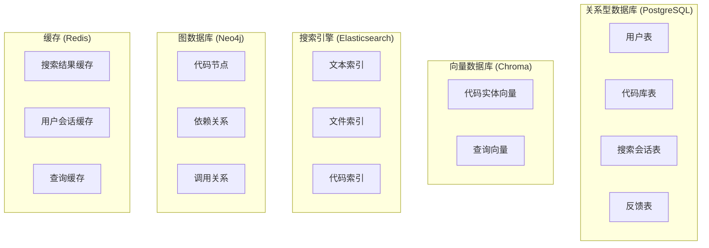
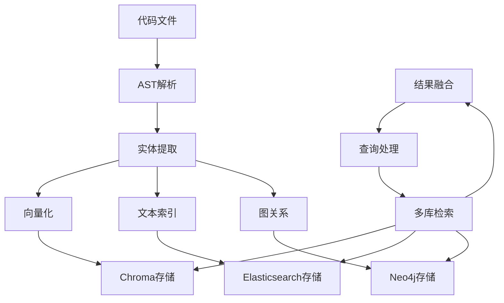

# MomoCodeAgent 数据库设计文档

## 1. 数据库架构概览

### 1.1 多数据库架构



### 1.2 数据流向



## 2. 关系型数据库设计 (PostgreSQL)

### 2.1 用户管理表

#### 用户表 (users)
```sql
CREATE TABLE users (
    id UUID PRIMARY KEY DEFAULT gen_random_uuid(),
    username VARCHAR(50) UNIQUE NOT NULL,
    email VARCHAR(255) UNIQUE NOT NULL,
    password_hash VARCHAR(255) NOT NULL,
    full_name VARCHAR(100),
    avatar_url VARCHAR(500),
    role VARCHAR(20) DEFAULT 'user' CHECK (role IN ('user', 'admin', 'enterprise')),
    status VARCHAR(20) DEFAULT 'active' CHECK (status IN ('active', 'inactive', 'suspended')),
    created_at TIMESTAMP WITH TIME ZONE DEFAULT CURRENT_TIMESTAMP,
    updated_at TIMESTAMP WITH TIME ZONE DEFAULT CURRENT_TIMESTAMP,
    last_login_at TIMESTAMP WITH TIME ZONE
);

CREATE INDEX idx_users_username ON users(username);
CREATE INDEX idx_users_email ON users(email);
CREATE INDEX idx_users_status ON users(status);
```

#### 用户会话表 (user_sessions)
```sql
CREATE TABLE user_sessions (
    id UUID PRIMARY KEY DEFAULT gen_random_uuid(),
    user_id UUID NOT NULL REFERENCES users(id) ON DELETE CASCADE,
    token_hash VARCHAR(255) NOT NULL,
    expires_at TIMESTAMP WITH TIME ZONE NOT NULL,
    created_at TIMESTAMP WITH TIME ZONE DEFAULT CURRENT_TIMESTAMP,
    last_accessed_at TIMESTAMP WITH TIME ZONE DEFAULT CURRENT_TIMESTAMP,
    ip_address INET,
    user_agent TEXT
);

CREATE INDEX idx_user_sessions_user_id ON user_sessions(user_id);
CREATE INDEX idx_user_sessions_token_hash ON user_sessions(token_hash);
CREATE INDEX idx_user_sessions_expires_at ON user_sessions(expires_at);
```

### 2.2 代码库管理表

#### 代码库表 (repositories)
```sql
CREATE TABLE repositories (
    id UUID PRIMARY KEY DEFAULT gen_random_uuid(),
    name VARCHAR(100) NOT NULL,
    description TEXT,
    path VARCHAR(500) NOT NULL,
    git_url VARCHAR(500),
    git_branch VARCHAR(100) DEFAULT 'main',
    owner_id UUID NOT NULL REFERENCES users(id) ON DELETE CASCADE,
    languages TEXT[] DEFAULT '{}',
    indexing_status VARCHAR(20) DEFAULT 'pending' CHECK (indexing_status IN ('pending', 'indexing', 'completed', 'failed')),
    indexing_progress INTEGER DEFAULT 0 CHECK (indexing_progress >= 0 AND indexing_progress <= 100),
    last_indexed_at TIMESTAMP WITH TIME ZONE,
    created_at TIMESTAMP WITH TIME ZONE DEFAULT CURRENT_TIMESTAMP,
    updated_at TIMESTAMP WITH TIME ZONE DEFAULT CURRENT_TIMESTAMP,
    settings JSONB DEFAULT '{}'
);

CREATE INDEX idx_repositories_owner_id ON repositories(owner_id);
CREATE INDEX idx_repositories_indexing_status ON repositories(indexing_status);
CREATE INDEX idx_repositories_languages ON repositories USING GIN(languages);
```

#### 代码库权限表 (repository_permissions)
```sql
CREATE TABLE repository_permissions (
    id UUID PRIMARY KEY DEFAULT gen_random_uuid(),
    repository_id UUID NOT NULL REFERENCES repositories(id) ON DELETE CASCADE,
    user_id UUID NOT NULL REFERENCES users(id) ON DELETE CASCADE,
    permission VARCHAR(20) NOT NULL CHECK (permission IN ('read', 'write', 'admin')),
    granted_by UUID NOT NULL REFERENCES users(id),
    granted_at TIMESTAMP WITH TIME ZONE DEFAULT CURRENT_TIMESTAMP,
    UNIQUE(repository_id, user_id)
);

CREATE INDEX idx_repository_permissions_repo_id ON repository_permissions(repository_id);
CREATE INDEX idx_repository_permissions_user_id ON repository_permissions(user_id);
```

### 2.3 搜索相关表

#### 搜索会话表 (search_sessions)
```sql
CREATE TABLE search_sessions (
    id UUID PRIMARY KEY DEFAULT gen_random_uuid(),
    user_id UUID NOT NULL REFERENCES users(id) ON DELETE CASCADE,
    repository_id UUID REFERENCES repositories(id) ON DELETE SET NULL,
    query_text TEXT NOT NULL,
    query_type VARCHAR(20) DEFAULT 'basic' CHECK (query_type IN ('basic', 'explore', 'diagnose', 'refactor')),
    filters JSONB DEFAULT '{}',
    options JSONB DEFAULT '{}',
    result_count INTEGER DEFAULT 0,
    search_time_ms INTEGER,
    created_at TIMESTAMP WITH TIME ZONE DEFAULT CURRENT_TIMESTAMP
);

CREATE INDEX idx_search_sessions_user_id ON search_sessions(user_id);
CREATE INDEX idx_search_sessions_repository_id ON search_sessions(repository_id);
CREATE INDEX idx_search_sessions_created_at ON search_sessions(created_at);
CREATE INDEX idx_search_sessions_query_type ON search_sessions(query_type);
```

#### 搜索结果表 (search_results)
```sql
CREATE TABLE search_results (
    id UUID PRIMARY KEY DEFAULT gen_random_uuid(),
    session_id UUID NOT NULL REFERENCES search_sessions(id) ON DELETE CASCADE,
    entity_id VARCHAR(100) NOT NULL,
    entity_type VARCHAR(20) NOT NULL,
    file_path VARCHAR(500) NOT NULL,
    score DECIMAL(5,4) NOT NULL,
    match_type VARCHAR(20) NOT NULL,
    highlights TEXT[],
    rank_position INTEGER NOT NULL,
    created_at TIMESTAMP WITH TIME ZONE DEFAULT CURRENT_TIMESTAMP
);

CREATE INDEX idx_search_results_session_id ON search_results(session_id);
CREATE INDEX idx_search_results_entity_id ON search_results(entity_id);
CREATE INDEX idx_search_results_score ON search_results(score DESC);
```

### 2.4 反馈表

#### 用户反馈表 (user_feedback)
```sql
CREATE TABLE user_feedback (
    id UUID PRIMARY KEY DEFAULT gen_random_uuid(),
    user_id UUID NOT NULL REFERENCES users(id) ON DELETE CASCADE,
    session_id UUID REFERENCES search_sessions(id) ON DELETE SET NULL,
    result_id UUID REFERENCES search_results(id) ON DELETE SET NULL,
    feedback_type VARCHAR(20) NOT NULL CHECK (feedback_type IN ('rating', 'helpful', 'not_helpful', 'bug_report', 'feature_request')),
    rating INTEGER CHECK (rating >= 1 AND rating <= 5),
    comment TEXT,
    metadata JSONB DEFAULT '{}',
    created_at TIMESTAMP WITH TIME ZONE DEFAULT CURRENT_TIMESTAMP
);

CREATE INDEX idx_user_feedback_user_id ON user_feedback(user_id);
CREATE INDEX idx_user_feedback_session_id ON user_feedback(session_id);
CREATE INDEX idx_user_feedback_type ON user_feedback(feedback_type);
CREATE INDEX idx_user_feedback_rating ON user_feedback(rating);
```

## 3. 向量数据库设计 (Chroma)

### 3.1 代码实体向量集合

```python
# 代码实体向量集合
code_entities_collection = {
    "name": "code_entities",
    "metadata": {
        "description": "存储代码实体的向量表示",
        "embedding_model": "sentence-transformers/all-MiniLM-L6-v2",
        "dimension": 384
    },
    "documents": [
        {
            "id": "entity_001",
            "text": "def authenticate_user(username, password):",
            "metadata": {
                "entity_type": "function",
                "name": "authenticate_user",
                "file_path": "src/auth/user_auth.py",
                "start_line": 45,
                "end_line": 67,
                "language": "python",
                "repository_id": "repo_123",
                "created_at": "2024-01-15T10:30:00Z"
            }
        }
    ]
}
```

### 3.2 查询向量集合

```python
# 查询向量集合
queries_collection = {
    "name": "user_queries",
    "metadata": {
        "description": "存储用户查询的向量表示",
        "embedding_model": "sentence-transformers/all-MiniLM-L6-v2",
        "dimension": 384
    },
    "documents": [
        {
            "id": "query_001",
            "text": "查找用户认证相关的函数",
            "metadata": {
                "user_id": "user_123",
                "session_id": "session_456",
                "query_type": "semantic",
                "created_at": "2024-01-15T10:30:00Z"
            }
        }
    ]
}
```

## 4. 搜索引擎设计 (Elasticsearch)

### 4.1 代码文件索引

```json
{
  "mappings": {
    "properties": {
      "file_path": {
        "type": "keyword"
      },
      "file_name": {
        "type": "text",
        "analyzer": "standard"
      },
      "content": {
        "type": "text",
        "analyzer": "code_analyzer"
      },
      "language": {
        "type": "keyword"
      },
      "file_size": {
        "type": "long"
      },
      "last_modified": {
        "type": "date"
      },
      "entities": {
        "type": "nested",
        "properties": {
          "type": {
            "type": "keyword"
          },
          "name": {
            "type": "text",
            "analyzer": "standard"
          },
          "start_line": {
            "type": "integer"
          },
          "end_line": {
            "type": "integer"
          },
          "content": {
            "type": "text",
            "analyzer": "code_analyzer"
          }
        }
      },
      "repository_id": {
        "type": "keyword"
      },
      "indexed_at": {
        "type": "date"
      }
    }
  },
  "settings": {
    "analysis": {
      "analyzer": {
        "code_analyzer": {
          "type": "custom",
          "tokenizer": "standard",
          "filter": [
            "lowercase",
            "code_filter"
          ]
        }
      },
      "filter": {
        "code_filter": {
          "type": "pattern_replace",
          "pattern": "[^a-zA-Z0-9_]",
          "replacement": " "
        }
      }
    }
  }
}
```

### 4.2 搜索查询示例

```json
{
  "query": {
    "bool": {
      "must": [
        {
          "multi_match": {
            "query": "用户认证",
            "fields": ["content", "entities.name", "entities.content"],
            "type": "best_fields",
            "fuzziness": "AUTO"
          }
        }
      ],
      "filter": [
        {
          "term": {
            "language": "python"
          }
        },
        {
          "wildcard": {
            "file_path": "**/auth/**"
          }
        }
      ]
    }
  },
  "highlight": {
    "fields": {
      "content": {
        "fragment_size": 150,
        "number_of_fragments": 3
      },
      "entities.content": {
        "fragment_size": 100,
        "number_of_fragments": 2
      }
    }
  },
  "sort": [
    "_score",
    {
      "last_modified": {
        "order": "desc"
      }
    }
  ]
}
```

## 5. 图数据库设计 (Neo4j)

### 5.1 节点类型定义

```cypher
// 代码文件节点
CREATE CONSTRAINT file_path_unique FOR (f:File) REQUIRE f.path IS UNIQUE;

// 函数节点
CREATE CONSTRAINT function_signature_unique FOR (func:Function) REQUIRE func.signature IS UNIQUE;

// 类节点
CREATE CONSTRAINT class_name_unique FOR (c:Class) REQUIRE c.name IS UNIQUE;

// 变量节点
CREATE CONSTRAINT variable_name_unique FOR (v:Variable) REQUIRE v.name IS UNIQUE;
```

### 5.2 关系类型定义

```cypher
// 文件包含关系
CREATE (f:File)-[:CONTAINS]->(func:Function)

// 函数调用关系
CREATE (func1:Function)-[:CALLS]->(func2:Function)

// 类继承关系
CREATE (c1:Class)-[:INHERITS]->(c2:Class)

// 依赖关系
CREATE (f1:File)-[:DEPENDS_ON]->(f2:File)

// 导入关系
CREATE (f1:File)-[:IMPORTS]->(f2:File)
```

### 5.3 查询示例

```cypher
// 查找函数调用链
MATCH (start:Function {name: 'authenticate_user'})
CALL apoc.path.subgraphAll(start, {
    relationshipFilter: 'CALLS>',
    maxDepth: 5
})
YIELD nodes, relationships
RETURN nodes, relationships;

// 查找文件依赖关系
MATCH (f:File)-[:DEPENDS_ON*1..3]->(target:File)
WHERE f.path CONTAINS 'auth'
RETURN f, target;

// 查找相似函数
MATCH (f1:Function)-[:SIMILAR_TO]->(f2:Function)
WHERE f1.name CONTAINS 'auth'
RETURN f1, f2;
```

## 6. 缓存设计 (Redis)

### 6.1 缓存键设计

```python
# 缓存键命名规范
CACHE_KEYS = {
    "search_result": "search:result:{query_hash}:{filters_hash}",
    "user_session": "user:session:{user_id}",
    "repository_status": "repo:status:{repo_id}",
    "file_content": "file:content:{file_hash}",
    "entity_embeddings": "entity:embeddings:{entity_id}",
    "query_suggestions": "query:suggestions:{query_prefix}"
}

# 缓存过期时间
CACHE_TTL = {
    "search_result": 3600,      # 1小时
    "user_session": 7200,       # 2小时
    "repository_status": 300,   # 5分钟
    "file_content": 1800,       # 30分钟
    "entity_embeddings": 86400, # 24小时
    "query_suggestions": 1800   # 30分钟
}
```

### 6.2 缓存数据结构

```python
# 搜索结果缓存
search_cache = {
    "key": "search:result:abc123:def456",
    "value": {
        "query": "查找用户认证函数",
        "results": [...],
        "total_count": 15,
        "search_time_ms": 245,
        "cached_at": "2024-01-15T10:30:00Z"
    },
    "ttl": 3600
}

# 用户会话缓存
session_cache = {
    "key": "user:session:user_123",
    "value": {
        "user_id": "user_123",
        "username": "john_doe",
        "role": "user",
        "permissions": [...],
        "last_activity": "2024-01-15T10:30:00Z"
    },
    "ttl": 7200
}
```

## 7. 数据迁移和备份

### 7.1 数据迁移策略

```sql
-- 版本控制表
CREATE TABLE schema_migrations (
    version VARCHAR(255) PRIMARY KEY,
    applied_at TIMESTAMP WITH TIME ZONE DEFAULT CURRENT_TIMESTAMP
);

-- 迁移脚本示例
INSERT INTO schema_migrations (version) VALUES ('001_create_users_table');
INSERT INTO schema_migrations (version) VALUES ('002_create_repositories_table');
```

### 7.2 备份策略

```bash
#!/bin/bash
# 数据库备份脚本

# PostgreSQL备份
pg_dump -h localhost -U momocodeagent -d momocodeagent > backup_$(date +%Y%m%d_%H%M%S).sql

# Elasticsearch备份
curl -X PUT "localhost:9200/_snapshot/backup_repo/snapshot_$(date +%Y%m%d_%H%M%S)" -H 'Content-Type: application/json' -d'
{
  "indices": "*",
  "ignore_unavailable": true,
  "include_global_state": false
}'

# Redis备份
redis-cli BGSAVE
```

## 8. 性能优化

### 8.1 索引优化

```sql
-- 复合索引
CREATE INDEX idx_search_sessions_user_repo ON search_sessions(user_id, repository_id, created_at);

-- 部分索引
CREATE INDEX idx_active_users ON users(username) WHERE status = 'active';

-- 表达式索引
CREATE INDEX idx_repo_language_count ON repositories(array_length(languages, 1));
```

### 8.2 查询优化

```sql
-- 使用EXPLAIN分析查询计划
EXPLAIN (ANALYZE, BUFFERS) 
SELECT s.*, r.name as repo_name 
FROM search_sessions s 
JOIN repositories r ON s.repository_id = r.id 
WHERE s.user_id = 'user_123' 
ORDER BY s.created_at DESC 
LIMIT 20;
```

### 8.3 缓存优化

```python
# 缓存预热
def warm_up_cache():
    # 预加载热门查询
    popular_queries = get_popular_queries()
    for query in popular_queries:
        cache_search_result(query)
    
    # 预加载用户会话
    active_users = get_active_users()
    for user in active_users:
        cache_user_session(user.id)
```

这个数据库设计文档提供了完整的数据存储方案，包括关系型数据库、向量数据库、搜索引擎、图数据库和缓存系统的设计，确保系统能够高效地存储和检索代码数据。
