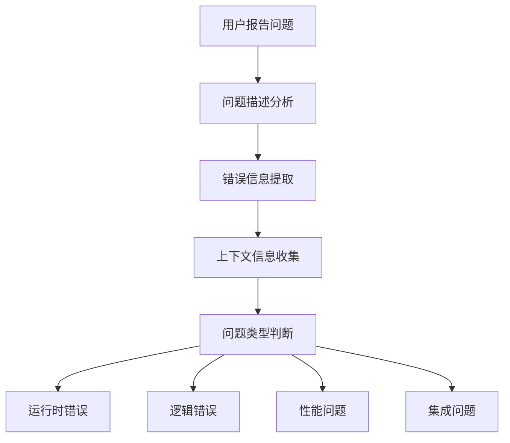
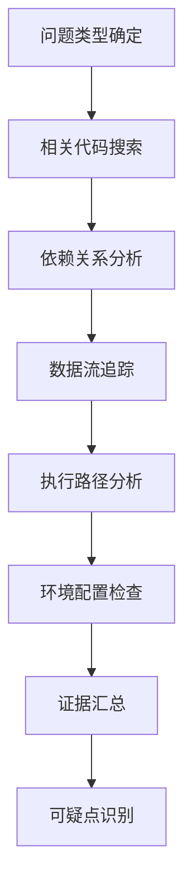
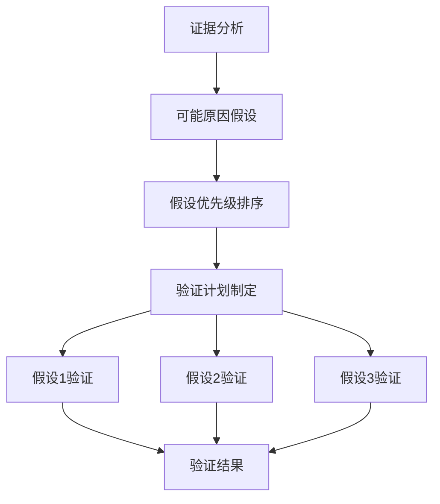
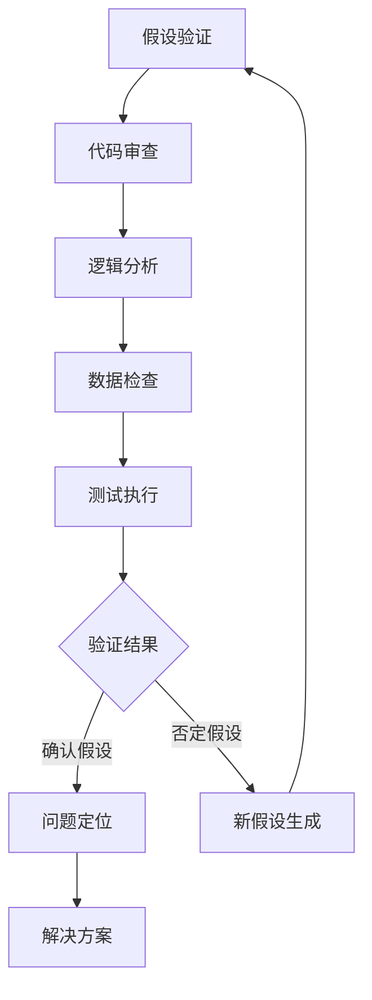
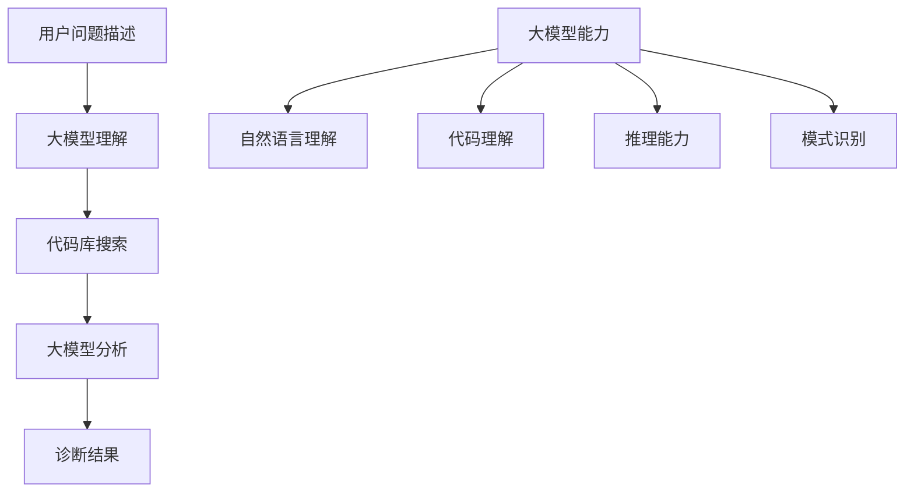
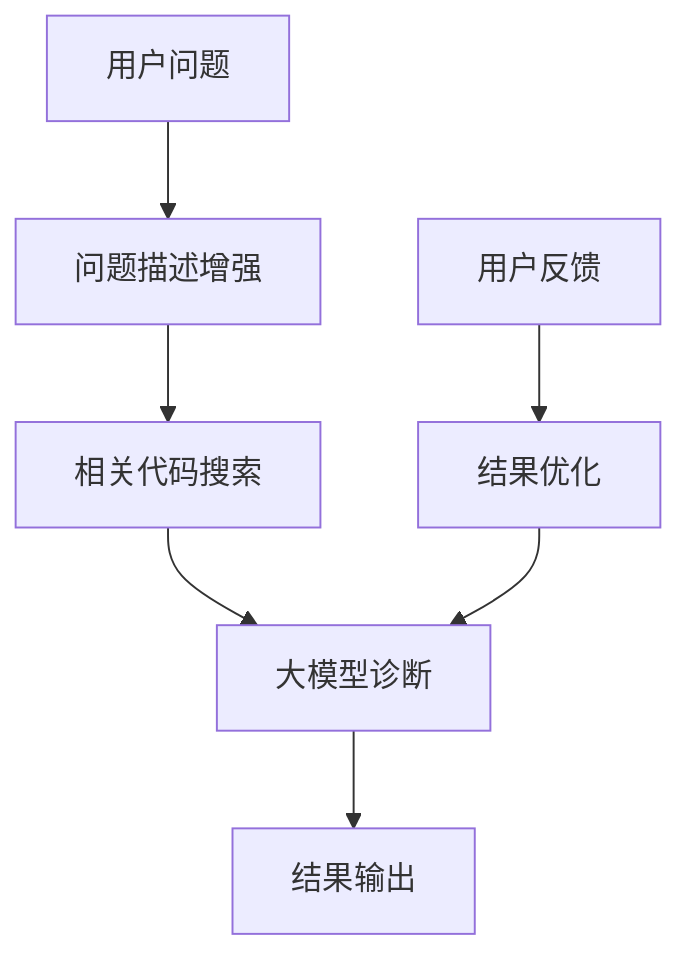

# 对于一个复杂查询，比如debugging场景，怎么样让Agent，一步步发现关键问题?

这是一个非常有趣的问题！debugging场景确实需要Agent具备"侦探式"的推理能力，一步步抽丝剥茧找到问题根源。让我设计一个debugging Agent的推理流程。

## Debugging Agent的推理架构

### 1. **问题理解阶段**



**具体分析过程**：
- **错误信息解析**：提取错误类型、堆栈信息、错误位置
- **上下文理解**：分析用户的操作步骤、输入数据、环境状态
- **问题分类**：判断是语法错误、逻辑错误、还是环境问题

### 2. **证据收集阶段**



**搜索策略**：
- **错误位置代码**：直接查看报错的具体代码
- **调用链分析**：追踪函数的调用路径
- **数据流分析**：分析数据的传递和变换过程
- **配置检查**：检查相关的配置文件和环境变量

### 3. **假设生成阶段**



**假设生成策略**：
- **常见错误模式**：基于历史数据识别常见错误类型
- **代码质量分析**：检查代码中的潜在问题点
- **依赖关系分析**：分析模块间的依赖问题
- **数据一致性检查**：检查数据的状态和一致性

### 4. **逐步验证阶段**



## 具体Debugging场景示例

### 场景1：数据库连接失败

**用户报告**：
```
"应用启动时报错：Database connection failed"
```

**Agent推理过程**：

**第1步：问题理解**
```
错误信息：Database connection failed
错误位置：app/database.py:25
错误类型：连接异常
```

**第2步：证据收集**
```
搜索相关代码：
- app/database.py:25 (连接代码)
- config/database.yaml (数据库配置)
- app/models.py (数据模型)

分析调用链：
main() → init_database() → connect()
```

**第3步：假设生成**
```
假设1：数据库服务未启动
假设2：连接参数错误
假设3：网络连接问题
假设4：权限问题
```

**第4步：逐步验证**
```
验证假设1：检查数据库服务状态
验证假设2：检查连接参数配置
验证假设3：测试网络连通性
验证假设4：检查用户权限
```

**第5步：问题定位**
```
发现：数据库配置文件中host参数错误
解决方案：修正host参数为正确的数据库地址
```

### 场景2：API返回错误数据

**用户报告**：
```
"API返回的数据格式不对，缺少某些字段"
```

**Agent推理过程**：

**第1步：问题理解**
```
问题类型：数据格式问题
影响范围：API响应
用户期望：完整的字段信息
```

**第2步：证据收集**
```
搜索相关代码：
- api/user.py (用户API)
- models/user.py (用户模型)
- serializers/user.py (数据序列化)

分析数据流：
数据库 → 模型 → 序列化器 → API响应
```

**第3步：假设生成**
```
假设1：序列化器配置错误
假设2：模型字段缺失
假设3：数据库查询不完整
假设4：API版本不匹配
```

**第4步：逐步验证**
```
验证假设1：检查序列化器字段配置
验证假设2：检查模型定义
验证假设3：检查数据库查询语句
验证假设4：检查API版本兼容性
```

**第5步：问题定位**
```
发现：序列化器中缺少某个字段的序列化规则
解决方案：在序列化器中添加缺失字段
```

## Debugging Agent的核心能力

### 1. **代码理解能力**
- **语法分析**：理解代码的语法结构
- **语义分析**：理解代码的业务逻辑
- **依赖分析**：理解模块间的依赖关系

### 2. **推理能力**
- **因果推理**：从结果推断原因
- **假设验证**：生成和验证假设
- **模式识别**：识别常见的错误模式

### 3. **搜索能力**
- **精确搜索**：快速定位相关代码
- **关联搜索**：找到相关的配置和依赖
- **历史搜索**：查找类似问题的解决方案

### 4. **分析能力**
- **数据流分析**：追踪数据的传递过程
- **执行路径分析**：分析代码的执行流程
- **状态分析**：分析系统的状态变化

## MVP中的简化实现

对于MVP原型机，可以这样简化debugging能力：

### 1. **问题分类简化**
```
错误类型：
- 语法错误：代码语法问题
- 运行时错误：程序运行时的异常
- 逻辑错误：业务逻辑问题
- 配置错误：配置文件问题
```

### 2. **推理流程简化**
```
简化流程：
1. 错误信息解析
2. 相关代码搜索
3. 常见问题匹配
4. 解决方案推荐
```

### 3. **验证策略简化**
```
验证方法：
- 代码审查：检查代码中的明显问题
- 配置检查：检查配置文件的一致性
- 依赖检查：检查依赖关系的正确性
```

这个debugging Agent的设计让系统能够像经验丰富的开发者一样，逐步分析问题、收集证据、生成假设、验证假设，最终找到问题的根源。您觉得这个推理流程设计如何？


# 假如这样设计，系统会变的非常复杂，借用大模型该怎么解决？
您说得非常对！我刚才的设计确实过于复杂了。让我重新思考如何利用大模型的能力来简化这个系统。

## 大模型驱动的简化方案

### 1. **核心思路转变**

**传统复杂方案**：
```
多步骤推理 → 证据收集 → 假设生成 → 逐步验证 → 问题定位
```

**大模型简化方案**：
```
问题描述 → 大模型分析 → 直接给出诊断结果
```

### 2. **大模型的核心优势**



**大模型能做什么**：
- **自然语言理解**：直接理解用户的问题描述
- **代码理解**：理解代码的语义和逻辑
- **推理能力**：基于代码和问题描述进行推理
- **模式识别**：识别常见的错误模式

### 3. **简化的Debugging流程**



**具体实现**：

**第1步：问题描述增强**
```
用户输入："API返回数据格式不对"
大模型增强："用户报告API接口返回的数据格式不符合预期，可能缺少某些字段或字段类型不正确"
```

**第2步：相关代码搜索**
```
基于增强的问题描述，搜索：
- API相关代码
- 数据模型代码
- 序列化相关代码
```

**第3步：大模型诊断**
```
输入给大模型：
- 用户问题描述
- 相关代码片段
- 错误信息（如果有）

大模型输出：
- 问题分析
- 可能原因
- 解决方案建议
```

### 4. **大模型Prompt设计**

**Debugging Prompt模板**：
```
你是一个经验丰富的软件工程师，擅长调试和问题诊断。

用户问题：{用户问题描述}

相关代码：
{相关代码片段}

错误信息：
{错误信息}

请分析问题并提供解决方案：
1. 问题分析：分析可能的原因
2. 代码检查：指出代码中的问题点
3. 解决方案：提供具体的修复建议
4. 预防措施：如何避免类似问题
```

### 5. **实际应用示例**

**场景：数据库连接失败**

**用户输入**：
```
"应用启动时报错：Database connection failed"
```

**系统处理**：
```
1. 搜索相关代码：database.py, config.yaml
2. 大模型分析：
   - 问题：数据库连接失败
   - 可能原因：配置错误、服务未启动、网络问题
   - 检查点：配置文件、服务状态、网络连接
   - 解决方案：修正配置、启动服务、检查网络
```

**大模型输出**：
```
问题分析：
根据错误信息"Database connection failed"，这是一个数据库连接问题。

可能原因：
1. 数据库服务未启动
2. 连接参数配置错误
3. 网络连接问题
4. 权限不足

检查建议：
1. 检查数据库服务状态
2. 验证连接参数（host, port, username, password）
3. 测试网络连通性
4. 检查用户权限

解决方案：
1. 启动数据库服务
2. 修正配置文件中的连接参数
3. 检查防火墙设置
4. 确认数据库用户权限
```

## 大模型方案的优势

### 1. **系统简化**
- **组件减少**：从多个Agent简化为一个大模型调用
- **流程简化**：从多步骤推理简化为直接分析
- **维护简单**：只需要优化Prompt，不需要复杂的规则

### 2. **能力强大**
- **自然语言理解**：直接理解用户的问题描述
- **代码理解**：理解代码的语义和逻辑
- **推理能力**：基于上下文进行推理
- **知识丰富**：具备广泛的编程知识

### 3. **开发效率**
- **快速实现**：基于现有大模型快速实现
- **易于扩展**：通过优化Prompt扩展能力
- **持续改进**：通过用户反馈不断优化

## MVP中的实现策略

### 1. **技术栈简化**
```
- 大模型：GPT-4或Claude
- 代码搜索：简单的关键词搜索
- 结果处理：直接输出大模型结果
```

### 2. **处理流程简化**
```
1. 用户问题输入
2. 相关代码搜索
3. 大模型分析
4. 结果输出
```

### 3. **成本控制**
```
- 缓存常见问题的分析结果
- 优化Prompt减少Token消耗
- 批量处理相似问题
```

## 总结

通过大模型，我们可以：

1. **大幅简化系统**：从复杂的多Agent系统简化为大模型调用
2. **提升能力**：利用大模型的强大理解能力
3. **降低开发成本**：不需要开发复杂的推理引擎
4. **快速迭代**：通过优化Prompt快速改进

这个方案让系统变得简单而强大，您觉得这个思路如何？