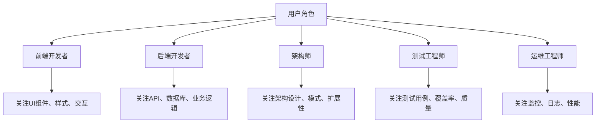

这是一个很好的问题！让我详细解释为什么在代码搜索系统中需要用户画像，以及它如何提升意图识别的效果。

## 用户画像的核心价值

### 1. **个性化意图理解**

不同用户对同一个查询可能有完全不同的意图：

**例子1：查询 "authentication"**
- **新手开发者**：想了解认证的基本概念和实现方式
- **资深开发者**：想找到具体的认证实现代码
- **架构师**：想分析认证系统的设计模式
- **测试工程师**：想找到认证相关的测试用例

**例子2：查询 "error handling"**
- **前端开发者**：关注用户界面的错误提示
- **后端开发者**：关注服务端的异常处理
- **运维工程师**：关注系统级别的错误监控

### 2. **上下文连续性理解**

用户画像帮助理解查询的连续性和关联性：

```
用户历史行为：
- 查询1: "login function" 
- 查询2: "password validation"
- 查询3: "session management"

当前查询: "security"

→ 用户画像分析：用户正在研究认证安全相关的功能
→ 意图理解：用户想了解安全相关的代码实现
→ 搜索策略：重点搜索认证、加密、安全相关的代码
```

### 3. **技术栈偏好识别**

不同用户有不同的技术偏好：

**Python开发者画像**：
- 偏好函数式编程风格
- 关注装饰器、生成器等Python特性
- 对Django、Flask等框架熟悉

**Java开发者画像**：
- 偏好面向对象设计
- 关注设计模式、Spring框架
- 对Maven、Gradle等构建工具熟悉

### 4. **工作角色适配**

不同角色的用户有不同的关注点：



## 用户画像的具体应用场景

### 1. **查询扩展和补全**

基于用户画像智能扩展查询：

```
用户输入: "user"
用户画像: 前端开发者，经常查询React组件
系统扩展: "user component" + "user interface" + "user management"
```

### 2. **结果个性化排序**

同样的搜索结果，不同用户看到不同的排序：

```
搜索结果: [UserService.java, UserController.java, UserComponent.tsx, UserTest.java]

前端开发者排序: UserComponent.tsx → UserController.java → UserService.java → UserTest.java
后端开发者排序: UserService.java → UserController.java → UserComponent.tsx → UserTest.java
测试工程师排序: UserTest.java → UserService.java → UserController.java → UserComponent.tsx
```

### 3. **智能建议生成**

基于用户画像提供相关建议：

```
用户查询: "database connection"
用户画像: 新手开发者，主要使用Python

系统建议:
- "SQLAlchemy connection pool"
- "Django database settings" 
- "PostgreSQL connection string"
- "Database migration examples"
```

## 用户画像的构建方式

### 1. **显式信息收集**
- 用户注册时的角色选择
- 技术栈偏好设置
- 工作经验级别

### 2. **隐式行为分析**
- 查询历史模式分析
- 点击和浏览行为
- 代码文件访问频率
- 停留时间分析

### 3. **动态更新机制**
- 实时行为学习
- 偏好变化检测
- 画像准确性评估

## 隐私和伦理考虑

### 1. **隐私保护**
- 数据匿名化处理
- 用户数据加密存储
- 用户可控制数据收集范围

### 2. **透明度**
- 用户了解画像用途
- 可查看和修改个人画像
- 可选择退出个性化功能

### 3. **公平性**
- 避免算法偏见
- 确保不同用户群体公平对待
- 定期审核画像准确性

## 实际效果对比

**没有用户画像的情况**：
```
查询: "authentication"
结果: 返回所有认证相关的代码，按通用相关性排序
问题: 可能包含用户不关心的技术栈或实现方式
```

**有用户画像的情况**：
```
查询: "authentication"
用户画像: Python开发者，Django框架，中级水平
结果: 优先返回Django认证相关代码，包含详细注释和最佳实践
效果: 更精准、更相关、更易理解
```

## 总结

用户画像在意图识别中的作用是**让系统理解"谁在问什么"**，而不仅仅是"问什么"。它通过：

1. **个性化理解**：根据用户特征理解查询意图
2. **上下文增强**：提供更丰富的查询上下文
3. **结果优化**：个性化排序和建议
4. **体验提升**：减少用户筛选时间，提高搜索效率

这样设计让代码搜索系统从"通用工具"变成"个人助手"，大大提升了用户体验和搜索效果。

您觉得这个解释合理吗？还有其他关于用户画像的疑问吗？