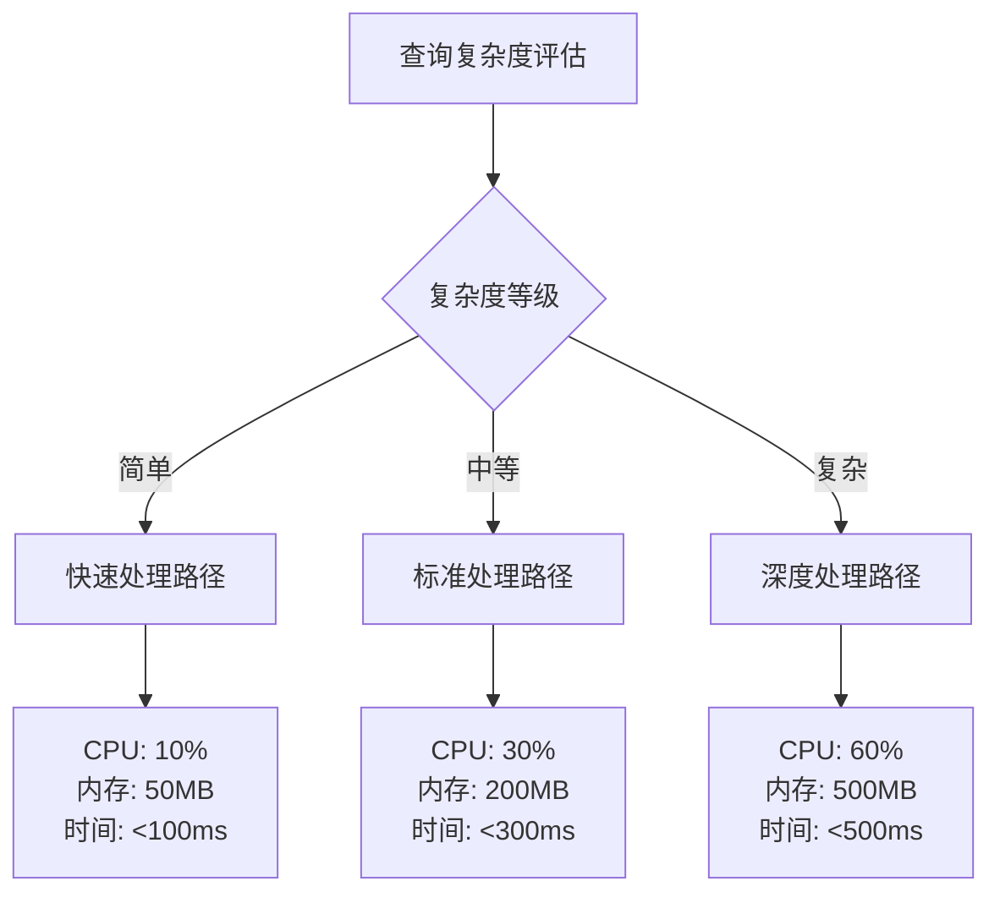
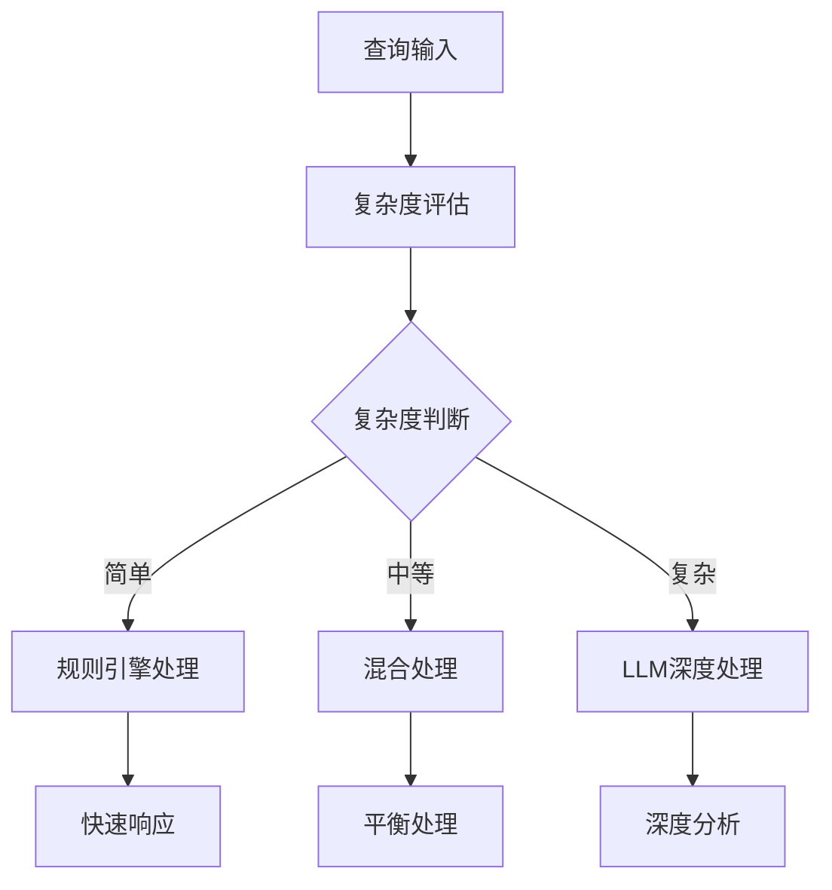
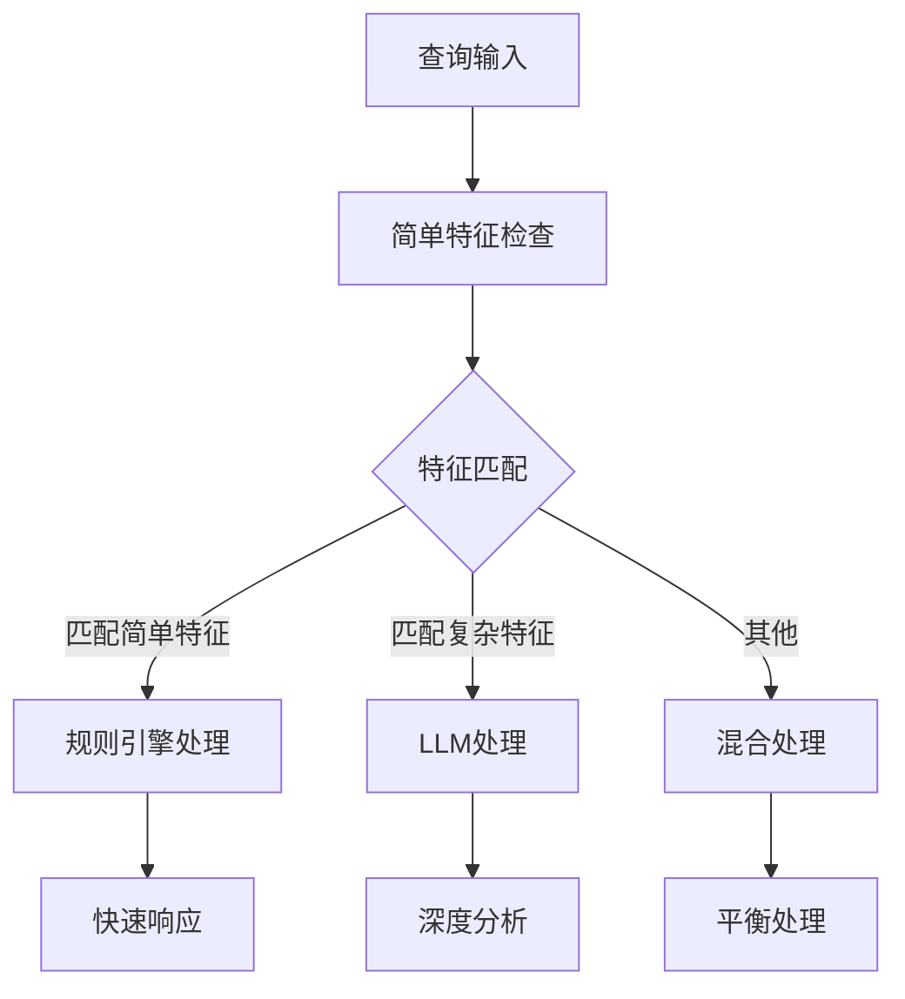

这是一个很好的问题！让我深入分析查询复杂度评估的价值和必要性。

## 查询复杂度评估的核心价值

### 1. **资源分配优化**

不同复杂度的查询需要不同的处理资源：



**实际价值**：
- 避免简单查询浪费复杂处理资源
- 确保复杂查询有足够的计算资源
- 提高系统整体吞吐量

### 2. **用户体验优化**

复杂度评估直接影响用户体验：

**简单查询**：
```
用户输入: "login function"
复杂度: 简单
处理策略: 快速关键词匹配
响应时间: <100ms
用户体验: 即时响应，感觉很快
```

**复杂查询**：
```
用户输入: "how does the authentication system handle different user roles and permissions"
复杂度: 复杂
处理策略: 深度语义分析 + 多维度搜索
响应时间: <500ms
用户体验: 虽然稍慢，但结果更准确
```

### 3. **成本控制**

在MVP阶段，成本控制尤其重要：

**LLM调用成本**：
- 简单查询：不需要LLM，使用规则引擎
- 中等查询：使用GPT-3.5，成本较低
- 复杂查询：使用GPT-4，成本较高

**计算资源成本**：
- 简单查询：单线程处理
- 中等查询：多线程并行
- 复杂查询：分布式处理

## 复杂度评估的具体应用

### 1. **处理策略选择**



### 2. **缓存策略优化**

**简单查询**：
- 缓存时间：24小时
- 缓存粒度：精确匹配
- 缓存策略：积极缓存

**复杂查询**：
- 缓存时间：1小时
- 缓存粒度：模糊匹配
- 缓存策略：谨慎缓存

### 3. **并发控制**

**简单查询**：
- 并发数：100
- 队列优先级：高
- 超时时间：100ms

**复杂查询**：
- 并发数：10
- 队列优先级：低
- 超时时间：500ms

## 复杂度评估的挑战

### 1. **评估准确性**

**挑战**：
- 如何准确判断查询复杂度？
- 避免误判导致的性能问题

**解决方案**：
- 多维度特征分析
- 历史数据学习
- 动态调整阈值

### 2. **评估成本**

**挑战**：
- 复杂度评估本身也需要计算资源
- 如何平衡评估成本和收益？

**解决方案**：
- 轻量级评估算法
- 缓存评估结果
- 渐进式评估

## MVP中的简化方案

对于MVP原型机，我建议这样简化复杂度评估：

### 1. **三级分类简化**

```
简单查询特征：
- 查询长度 < 20字符
- 包含明确关键词（function, class, variable）
- 语法结构简单

中等查询特征：
- 查询长度 20-50字符
- 包含多个关键词
- 语法结构中等

复杂查询特征：
- 查询长度 > 50字符
- 包含复杂语法结构
- 需要上下文理解
```

### 2. **处理策略简化**



### 3. **性能目标简化**

**简单查询**：
- 响应时间：< 100ms
- 准确率：> 90%
- 资源消耗：低

**复杂查询**：
- 响应时间：< 500ms
- 准确率：> 80%
- 资源消耗：高

## 总结

查询复杂度评估的价值在于：

1. **资源优化**：合理分配计算资源
2. **用户体验**：提供合适的响应时间
3. **成本控制**：避免不必要的资源浪费
4. **系统稳定性**：防止系统过载

对于MVP原型机，我建议：
- 使用简化的三级分类
- 基于简单特征进行判断
- 重点关注简单查询的快速响应
- 为复杂查询预留足够的处理时间

您觉得这个复杂度评估的设计合理吗？在MVP阶段是否需要进一步简化？