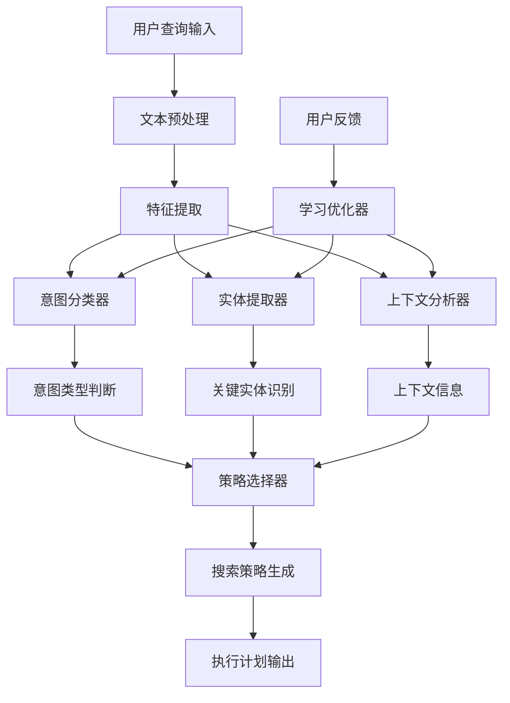
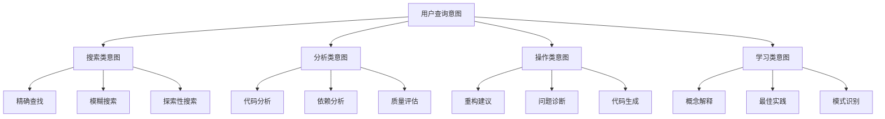
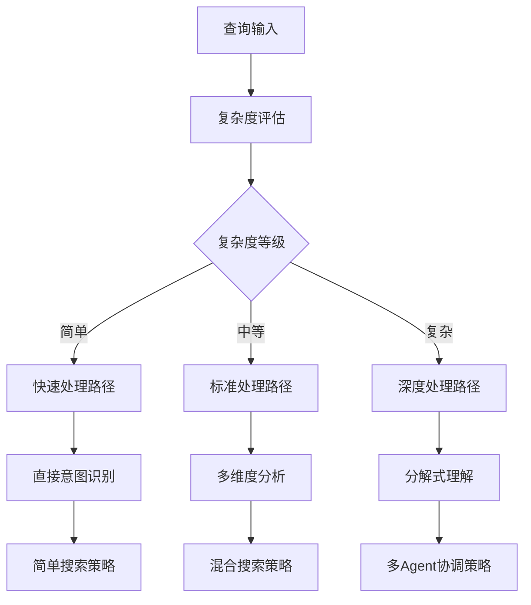
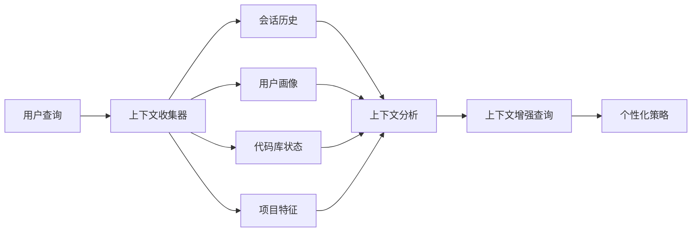
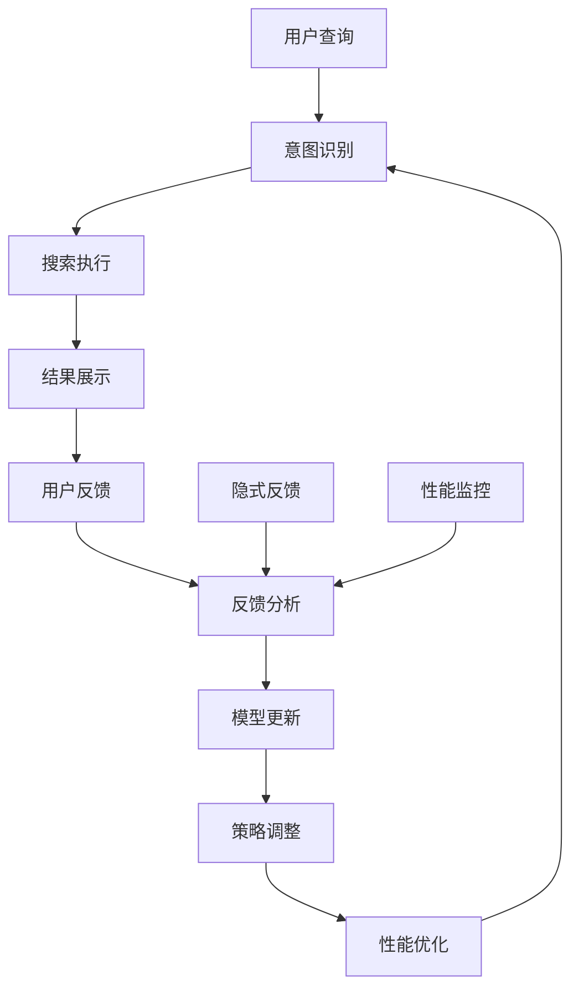
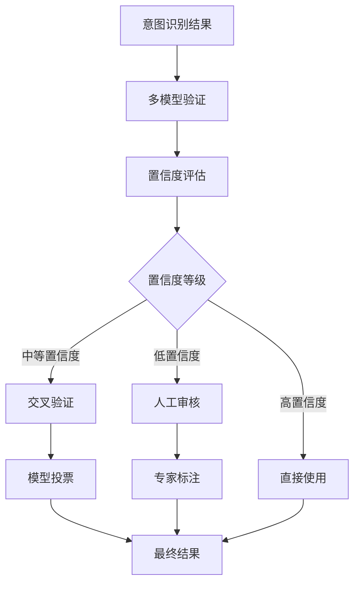
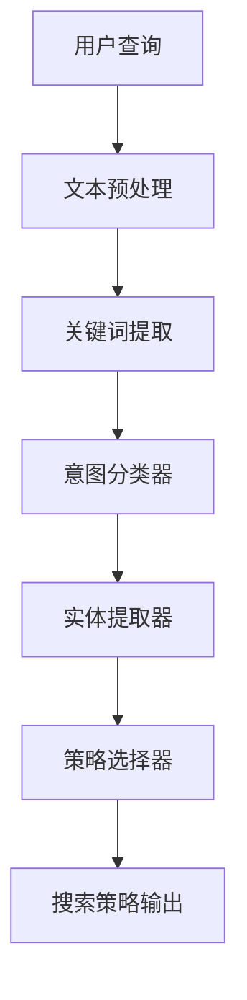

# MomoCodeAgent 意图识别设计方案

## 1. 设计目标与核心理念

### 1.1 设计目标
- **准确理解**：准确识别用户的真实查询意图
- **快速响应**：毫秒级意图识别响应时间
- **智能适应**：根据用户行为持续优化
- **场景感知**：理解不同使用场景下的查询需求

### 1.2 核心理念
- **多层次理解**：从表面语法到深层语义的全面理解
- **上下文感知**：结合用户状态和代码库环境
- **自适应决策**：根据查询复杂度动态选择处理策略
- **持续学习**：从用户反馈中不断改进

## 2. 整体架构设计

### 2.1 意图识别流程架构



### 2.2 核心组件职责

| 组件 | 主要职责 | 输入 | 输出 |
|------|----------|------|------|
| **文本预处理** | 清洗、标准化、分词 | 原始查询文本 | 标准化文本 |
| **特征提取** | 提取语法、语义、结构特征 | 标准化文本 | 特征向量 |
| **意图分类器** | 识别查询的主要意图类型 | 特征向量 | 意图类别 |
| **实体提取器** | 识别查询中的关键实体 | 特征向量 | 实体列表 |
| **上下文分析器** | 分析用户状态和环境信息 | 用户上下文 | 上下文特征 |
| **策略选择器** | 根据分析结果选择处理策略 | 意图+实体+上下文 | 搜索策略 |
| **学习优化器** | 从反馈中优化各组件 | 用户反馈 | 模型更新 |

## 3. 意图分类体系设计

### 3.1 主分类体系



### 3.2 意图特征描述

**搜索类意图**
- **精确查找**：用户明确知道要找什么，如"find login function"
- **模糊搜索**：用户有大致概念但不确定具体名称，如"something about authentication"
- **探索性搜索**：用户想了解代码库结构，如"how does this project work"

**分析类意图**
- **代码分析**：分析代码逻辑、性能、复杂度等
- **依赖分析**：分析模块间依赖关系
- **质量评估**：评估代码质量、规范性等

**操作类意图**
- **重构建议**：提供代码优化建议
- **问题诊断**：帮助调试和解决问题
- **代码生成**：生成新代码或修改现有代码

**学习类意图**
- **概念解释**：解释技术概念和原理
- **最佳实践**：推荐行业最佳实践
- **模式识别**：识别设计模式和架构模式

## 4. 智能决策机制设计

### 4.1 查询复杂度评估



### 4.2 策略选择逻辑

**简单查询处理**
- 特征：短查询、明确关键词、单一意图
- 策略：快速模式匹配 + 直接搜索
- 响应时间：< 100ms

**中等复杂度查询处理**
- 特征：中等长度、多个关键词、可能的多重意图
- 策略：多维度分析 + 混合搜索
- 响应时间：< 300ms

**复杂查询处理**
- 特征：长查询、复杂语法、多重意图、需要上下文
- 策略：深度理解 + 查询分解 + 多Agent协调
- 响应时间：< 500ms

## 5. 上下文感知机制设计

### 5.1 上下文信息收集



### 5.2 上下文应用策略

**会话历史应用**
- 维护用户在当前会话中的查询历史
- 识别查询的连续性和关联性
- 提供查询建议和自动补全

**用户画像应用**
- 基于历史行为构建用户偏好模型
- 个性化搜索结果排序
- 推荐相关功能和内容

**代码库状态应用**
- 识别用户当前查看的文件和位置
- 理解用户的工作上下文
- 提供相关的代码建议

**项目特征应用**
- 分析代码库的技术栈和架构
- 理解项目的业务领域
- 提供领域特定的建议

## 6. 学习适应机制设计

### 6.1 反馈学习流程



### 6.2 学习类型与策略

**显式反馈学习**
- 用户评分：对搜索结果质量的直接评价
- 查询修改：用户修改查询的行为分析
- 结果选择：用户点击和选择的行为模式

**隐式反馈学习**
- 停留时间：用户在结果页面的停留时间
- 滚动深度：用户查看结果的深度
- 后续行为：用户后续的查询和操作

**性能监控学习**
- 响应时间：不同策略的响应时间对比
- 准确率：意图识别的准确率统计
- 用户满意度：综合用户行为分析

## 7. 质量保证机制设计

### 7.1 准确性保证



### 7.2 性能保证

**响应时间控制**
- 简单查询：< 100ms
- 中等查询：< 300ms
- 复杂查询：< 500ms

**资源使用优化**
- 智能缓存：缓存常见查询的意图分析结果
- 并行处理：多个分析器并行工作
- 降级策略：高负载时使用简化策略

**监控告警**
- 实时性能监控
- 异常情况告警
- 自动故障恢复

## 8. 扩展性设计考虑

### 8.1 多语言支持
- 支持不同编程语言的查询模式
- 语言特定的实体识别规则
- 跨语言的意图理解能力

### 8.2 领域适应
- 支持不同业务领域的查询习惯
- 领域特定的词汇和概念理解
- 可配置的意图分类规则

### 8.3 用户个性化
- 个人查询习惯学习
- 个性化意图分类权重
- 自适应界面和交互

## 9. 设计优势与创新点

### 9.1 设计优势
- **多层次理解**：从语法到语义的全面分析
- **智能决策**：根据复杂度动态选择策略
- **上下文感知**：结合用户状态和环境信息
- **持续学习**：从用户反馈中不断优化

### 9.2 创新点
- **自适应复杂度评估**：动态评估查询复杂度
- **多Agent协调**：复杂查询的多Agent协作处理
- **上下文增强**：基于多维度上下文的查询增强
- **实时学习**：在线学习和模型更新机制

## 10. MVP原型机设计

### 10.1 MVP设计原则
- **核心功能优先**：只实现最基础的意图识别功能
- **简化架构**：去掉复杂的优化和学习机制
- **快速验证**：能够快速验证核心假设
- **易于扩展**：为后续功能扩展预留接口

### 10.2 MVP核心组件



### 10.3 MVP意图分类体系

**简化版分类（2大主类6子类）**：

```
📋 搜索类意图
├── 精确查找：找特定函数、类、变量
├── 模糊搜索：找相关功能或概念
└── 探索性搜索：了解代码库结构

🔍 分析类意图
├── 代码分析：分析代码逻辑和结构
├── 依赖分析：分析代码依赖关系
└── 问题诊断：错误调试和解决
```

### 10.4 MVP技术实现策略

**技术栈简化**：
- **LLM集成**：使用GPT-3.5或本地模型（降低成本）
- **规则引擎**：基于关键词和模式的简单规则
- **缓存机制**：简单的内存缓存
- **无学习机制**：静态规则，无动态优化

**处理流程简化**：
1. **文本预处理**：基础清洗和分词
2. **关键词匹配**：基于预定义关键词库
3. **意图分类**：简单的规则分类器
4. **实体提取**：基于正则表达式的实体识别
5. **策略输出**：直接映射到搜索策略

### 10.5 MVP性能目标

**响应时间**：
- 简单查询：< 200ms
- 复杂查询：< 500ms

**准确性目标**：
- 意图识别准确率：> 80%
- 实体提取准确率：> 85%

**资源消耗**：
- 内存使用：< 500MB
- CPU使用：< 50%

### 10.6 MVP功能边界

**包含功能**：
- ✅ 基础意图识别
- ✅ 关键词和实体提取
- ✅ 简单搜索策略选择
- ✅ 基础缓存机制

**不包含功能**：
- ❌ 用户画像和个性化
- ❌ 在线学习和优化
- ❌ 复杂上下文分析
- ❌ 多Agent协调
- ❌ 高级缓存策略

### 10.7 MVP验证指标

**功能验证**：
- 能否正确识别常见查询意图？
- 能否提取关键实体信息？
- 能否生成合适的搜索策略？

**性能验证**：
- 响应时间是否满足要求？
- 系统稳定性如何？
- 资源消耗是否可控？

**用户体验验证**：
- 用户能否理解系统行为？
- 搜索结果是否相关？
- 是否需要人工干预？

## 11. 讨论要点

### 11.1 MVP设计合理性讨论
1. **功能范围**：MVP的功能边界是否合适？是否需要调整？
2. **技术选型**：简化的技术栈是否满足需求？
3. **性能目标**：MVP的性能目标是否合理？
4. **扩展性**：MVP架构是否便于后续扩展？

### 11.2 实现优先级讨论
1. **核心功能**：哪些功能是MVP必须的？
2. **开发顺序**：应该按什么顺序开发各个组件？
3. **测试策略**：如何验证MVP的有效性？
4. **部署方案**：MVP的部署和运维策略？

### 11.3 后续演进讨论
1. **功能扩展**：MVP验证成功后，应该优先添加哪些功能？
2. **性能优化**：在哪些方面需要进一步优化？
3. **用户体验**：如何提升用户体验？
4. **技术升级**：何时引入更复杂的技术？

这个MVP设计为快速原型验证提供了清晰的路径，您觉得这个简化方案如何？有哪些需要调整的地方？
