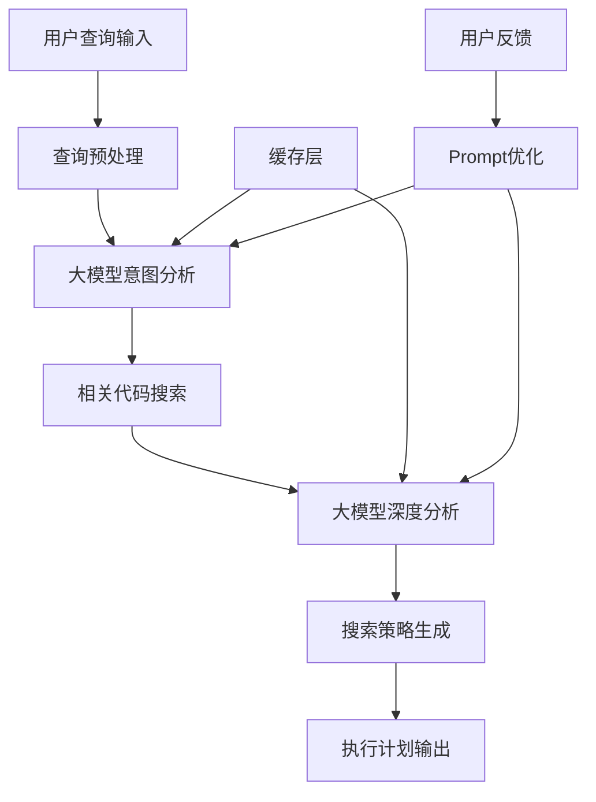
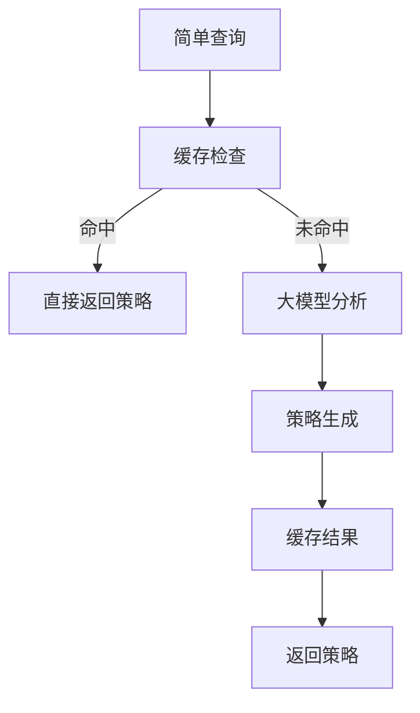
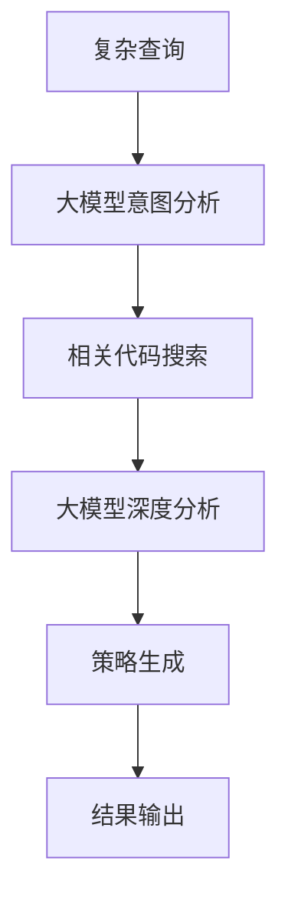
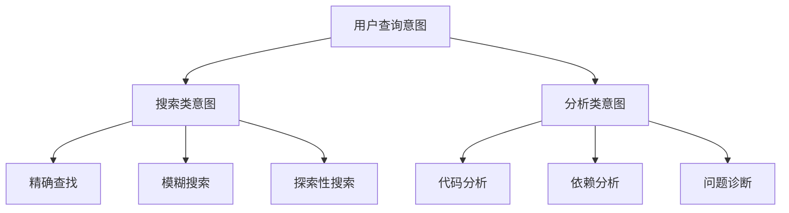
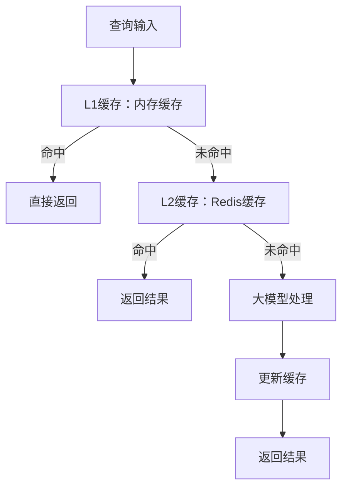
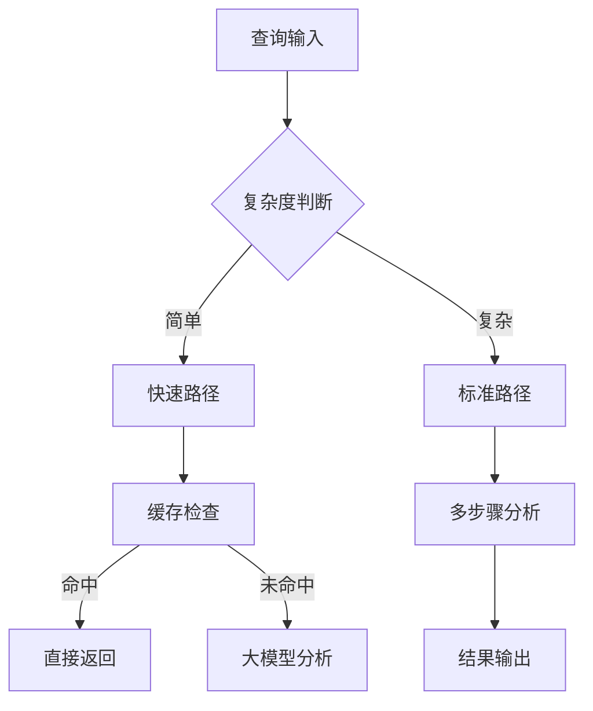
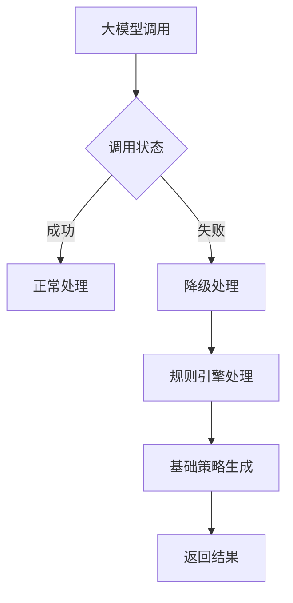
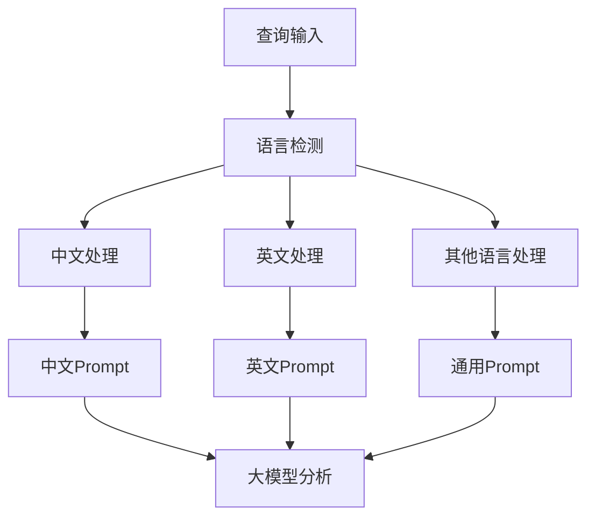
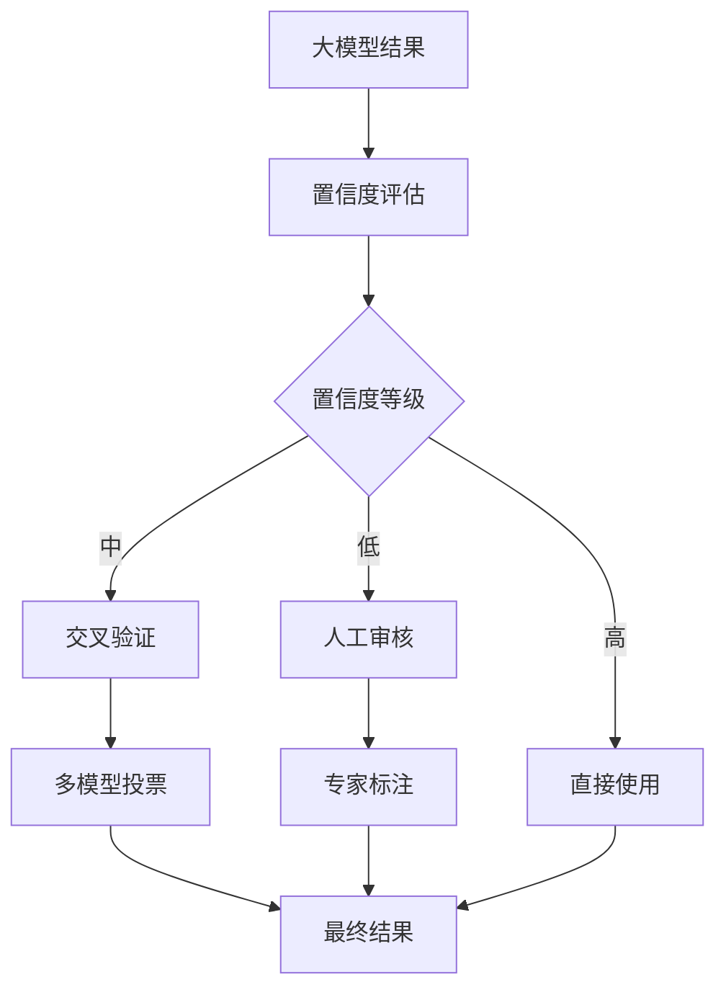
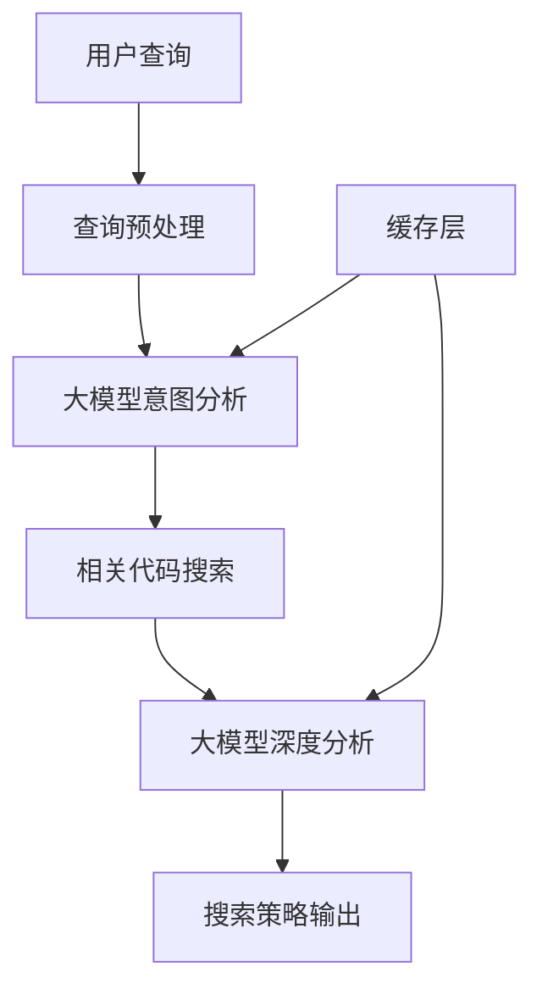

# MomoCodeAgent 意图识别设计方案 V2.0

## 1. 设计目标与核心理念

### 1.1 设计目标
- **准确理解**：准确识别用户的真实查询意图
- **快速响应**：毫秒级意图识别响应时间
- **智能适应**：根据用户行为持续优化
- **场景感知**：理解不同使用场景下的查询需求

### 1.2 核心理念
- **大模型驱动**：充分利用大模型的理解和推理能力
- **架构简化**：避免复杂的多Agent协作，采用直接分析模式
- **成本控制**：在保证效果的前提下控制大模型调用成本
- **快速迭代**：通过Prompt优化快速改进系统能力

## 2. 整体架构设计

### 2.1 大模型驱动的意图识别架构



### 2.2 核心组件职责

| 组件 | 主要职责 | 技术实现 | 输入输出 |
|------|----------|----------|----------|
| **查询预处理** | 基础清洗、标准化 | 正则表达式、分词 | 原始查询 → 标准化文本 |
| **大模型意图分析** | 理解查询意图和实体 | GPT-4/Claude | 标准化文本 → 意图分析结果 |
| **相关代码搜索** | 基于意图搜索相关代码 | 关键词搜索、语义搜索 | 意图分析 → 相关代码片段 |
| **大模型深度分析** | 结合代码进行深度分析 | GPT-4/Claude | 意图+代码 → 分析结果 |
| **搜索策略生成** | 生成具体的搜索策略 | 规则引擎 | 分析结果 → 搜索策略 |
| **缓存层** | 缓存常见查询结果 | Redis/内存缓存 | 查询+结果 → 缓存数据 |
| **Prompt优化** | 基于反馈优化Prompt | 反馈分析 | 用户反馈 → 优化Prompt |

### 2.3 处理流程设计

#### 2.3.1 简单查询处理流程



**特点**：
- 响应时间：< 200ms
- 处理方式：直接大模型分析
- 缓存策略：积极缓存

#### 2.3.2 复杂查询处理流程



**特点**：
- 响应时间：< 500ms
- 处理方式：多步骤分析
- 缓存策略：谨慎缓存

## 3. 意图分类体系设计

### 3.1 MVP简化分类体系



### 3.2 意图特征描述

**搜索类意图**
- **精确查找**：用户明确知道要找什么，如"find login function"
- **模糊搜索**：用户有大致概念但不确定具体名称，如"something about authentication"
- **探索性搜索**：用户想了解代码库结构，如"how does this project work"

**分析类意图**
- **代码分析**：分析代码逻辑、性能、复杂度等
- **依赖分析**：分析模块间依赖关系
- **问题诊断**：帮助调试和解决问题

## 4. 大模型Prompt设计

### 4.1 意图分析Prompt

```
你是一个专业的代码搜索助手，擅长理解用户的查询意图。

用户查询：{用户查询}

请分析以下内容：
1. 查询意图：用户想要做什么？
2. 实体信息：查询中涉及哪些关键实体？
3. 查询类型：精确查找/模糊搜索/探索性搜索/问题诊断
4. 复杂度：简单/中等/复杂

输出格式：
{
  "intent": "查询意图",
  "entities": ["实体1", "实体2"],
  "type": "查询类型",
  "complexity": "复杂度"
}
```

### 4.2 深度分析Prompt

```
你是一个经验丰富的软件工程师，擅长代码分析和问题诊断。

用户查询：{用户查询}
相关代码：{相关代码片段}

请提供：
1. 问题分析：分析可能的原因和问题点
2. 搜索建议：建议搜索哪些相关代码
3. 解决方案：提供具体的解决建议

输出格式：
{
  "analysis": "问题分析",
  "search_suggestions": ["建议1", "建议2"],
  "solutions": ["解决方案1", "解决方案2"]
}
```

### 4.3 调试场景Prompt

```
你是一个经验丰富的软件工程师，擅长调试和问题诊断。

用户问题：{用户问题描述}
相关代码：{相关代码片段}
错误信息：{错误信息}

请分析问题并提供解决方案：
1. 问题分析：分析可能的原因
2. 代码检查：指出代码中的问题点
3. 解决方案：提供具体的修复建议
4. 预防措施：如何避免类似问题

输出格式：
{
  "problem_analysis": "问题分析",
  "code_issues": ["问题点1", "问题点2"],
  "solutions": ["解决方案1", "解决方案2"],
  "prevention": "预防措施"
}
```

## 5. 缓存策略设计

### 5.1 缓存层级



### 5.2 缓存策略

**简单查询**：
- 缓存时间：24小时
- 缓存粒度：精确匹配
- 缓存策略：积极缓存

**复杂查询**：
- 缓存时间：1小时
- 缓存粒度：模糊匹配
- 缓存策略：谨慎缓存

## 6. 性能优化设计

### 6.1 响应时间优化



### 6.2 成本控制

**Token使用优化**：
- 压缩Prompt长度
- 批量处理相似查询
- 智能缓存策略

**API调用优化**：
- 缓存常见结果
- 异步处理
- 错误重试机制

## 7. 错误处理机制

### 7.1 降级策略



### 7.2 错误类型处理

**网络超时**：
- 重试机制：最多重试3次
- 超时时间：30秒
- 降级策略：使用规则引擎

**API限制**：
- 限流处理：等待后重试
- 降级策略：使用缓存结果
- 告警机制：及时通知运维

**模型错误**：
- 错误检测：检查返回格式
- 降级策略：使用备用模型
- 日志记录：详细记录错误信息

## 8. 扩展性设计

### 8.1 多语言支持



### 8.2 领域适应

**技术栈适应**：
- Python项目：Django、Flask相关Prompt
- Java项目：Spring、Maven相关Prompt
- JavaScript项目：React、Node.js相关Prompt

**业务领域适应**：
- 电商项目：订单、支付相关Prompt
- 金融项目：风控、交易相关Prompt
- 教育项目：课程、用户相关Prompt

## 9. 质量保证机制

### 9.1 准确性保证



### 9.2 性能监控

**关键指标**：
- 响应时间：P50、P95、P99
- 准确率：意图识别准确率
- 成本：Token消耗、API调用次数
- 用户满意度：反馈评分

## 10. MVP原型机设计

### 10.1 MVP设计原则
- **核心功能优先**：只实现最基础的意图识别功能
- **大模型驱动**：充分利用大模型能力，简化架构
- **快速验证**：能够快速验证核心假设
- **易于扩展**：为后续功能扩展预留接口

### 10.2 MVP核心组件



### 10.3 MVP技术栈

**技术选型**：
- **大模型**：GPT-3.5（降低成本）
- **缓存**：内存缓存（简化部署）
- **搜索**：关键词搜索（快速实现）
- **存储**：本地文件（无需数据库）

### 10.4 MVP性能目标

**响应时间**：
- 简单查询：< 200ms
- 复杂查询：< 500ms

**准确性目标**：
- 意图识别准确率：> 80%
- 实体提取准确率：> 85%

**资源消耗**：
- 内存使用：< 500MB
- CPU使用：< 50%

### 10.5 MVP功能边界

**包含功能**：
- ✅ 基础意图识别
- ✅ 关键词和实体提取
- ✅ 简单搜索策略选择
- ✅ 基础缓存机制
- ✅ 常见问题诊断

**不包含功能**：
- ❌ 复杂多Agent协作
- ❌ 在线学习优化
- ❌ 高级个性化
- ❌ 复杂上下文分析

### 10.6 MVP验证指标

**功能验证**：
- 能否正确识别常见查询意图？
- 能否提取关键实体信息？
- 能否生成合适的搜索策略？

**性能验证**：
- 响应时间是否满足要求？
- 系统稳定性如何？
- 资源消耗是否可控？

**用户体验验证**：
- 用户能否理解系统行为？
- 搜索结果是否相关？
- 是否需要人工干预？

## 11. 架构优势总结

### 11.1 大模型驱动的优势
- **能力强大**：充分利用大模型的理解和推理能力
- **架构简化**：避免复杂的多Agent协作机制
- **开发效率**：通过Prompt优化快速迭代
- **成本可控**：通过缓存和优化控制成本

### 11.2 与传统方案对比

| 方面 | 传统复杂方案 | 大模型驱动方案 |
|------|-------------|----------------|
| **架构复杂度** | 高（多Agent协作） | 低（直接分析） |
| **开发成本** | 高（需要开发多个组件） | 低（主要优化Prompt） |
| **维护成本** | 高（多个组件需要维护） | 低（主要维护Prompt） |
| **扩展性** | 中等（需要修改多个组件） | 高（通过Prompt快速扩展） |
| **准确性** | 高（多模型验证） | 高（大模型能力强） |
| **响应时间** | 中等（多步骤处理） | 快（直接分析） |

## 12. 讨论要点

### 12.1 MVP设计合理性讨论
1. **功能范围**：MVP的功能边界是否合适？是否需要调整？
2. **技术选型**：大模型驱动的技术栈是否满足需求？
3. **性能目标**：MVP的性能目标是否合理？
4. **扩展性**：MVP架构是否便于后续扩展？

### 12.2 实现优先级讨论
1. **核心功能**：哪些功能是MVP必须的？
2. **开发顺序**：应该按什么顺序开发各个组件？
3. **测试策略**：如何验证MVP的有效性？
4. **部署方案**：MVP的部署和运维策略？

### 12.3 后续演进讨论
1. **功能扩展**：MVP验证成功后，应该优先添加哪些功能？
2. **性能优化**：在哪些方面需要进一步优化？
3. **用户体验**：如何提升用户体验？
4. **技术升级**：何时引入更复杂的技术？

这个更新后的架构设计充分体现了大模型驱动的简化思路，既保持了强大的功能，又大幅降低了系统复杂度。通过充分利用大模型的能力，我们可以实现一个简单而强大的意图识别系统。
